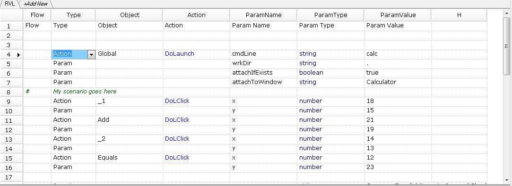

RVL script is a spreadsheet containing set of 7 columns in fixed order:

*Column View*

* 1st *Flow* -- Control flow. This column dedicated to specifying structural information such blocks, Branches (If-Else), loops.

    Also it contains information about single row and multi row comments. Possible values are limited by the list:
  *   `\#` or `//` - single row  comment
  * `/*` - begin of multi row comment (comment is valid up to line starting with `*/`)
  * `*/` - end of multi row comment started earlier from `/*`
  * `If` - conditional branch. Row type must be `Condition`. The row may be followed with one or more `ElseIf` statements, zero or one `Else` statement and then should end with `End`.

* 2nd *Type* -  Type of operation specified in this row. One of: 
  * `Action` - row defines an action. Action is a call for operation for one of the objects. Object is defined in the next column. See [Actions](Actions.md).
  * `Param` - signals that this row contains action parameter or condition parameter defined in last 3 columns (`ParamName`, `ParamType` and `ParamValue`).
  * `Output` - this type of row must go after last Param for an action and defines a variable that should accept output value retured from the call to the Action.
  * `Variable` - this row defines or assigns value to a local or global variable. See [Variables](Variables.md).
  * `Assert` - first row for the Assertion. See [Assertions](Assertions.md).
  * `Condition`
* 3rd *Object* - Id of the object to be used for action. Rapise provides set of predefined global objects and objects recorded/learned from the AUT.
* 4th *Action* - One of the actions. `DoAction`, `DoClick`, `GetText` etc.
* 5th *ParamName* - see [Params](Params.md) for more information on last 3 columns
* 6th *ParamType* 
* 7th *ParamValue* 

In addition to these columns there may be any number of other columns used for storing supplementary data, comments, calculations, thoughts etc. Additional columns may be utilized for script itself (i.e. contain expected values or reference data).

