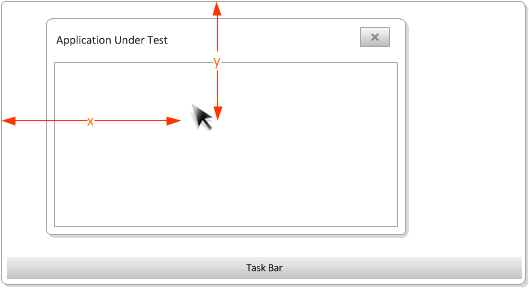

# Absolute Analog Recording

## Purpose

Absolute analog recording is used to track mouse usage (movement and clicks) and keyboard events.  For absolute analog recording, the positions these events are recorded relative to the top-left corner of the system screen.  (In contrast, in relative analog, the events are recorded relative to the upper-left corner of the selected objects.)  The events are recorded in a file of type arf (Analog Recording File).

## Value

Not all applications can be recorded by locating and learning objects being used.  A very good example of this is free-hand drawing in an application such as Microsoft Paint (`Start Menu > Accessories > Paint`).  There are several reasons why this application cannot be recorded using object tracking, learning and recording.  The most important is that when the mouse is moved free-hand, it is operating on the same object the whole time - the blank "canvas."  Another reason is that the application changes behaviour and the positions of the canvas change depending on the size of the canvas and the positions of floating toolbars.

Absolute analog recording is provided by Rapise to make it possible to make it possible to design and implement tests for these types of applications.

## See Also

- [Do Absolute Analog Recording](do_absolute_analog_recording.md)
- [Relative Analog Recording](relative_analog_learning.md)