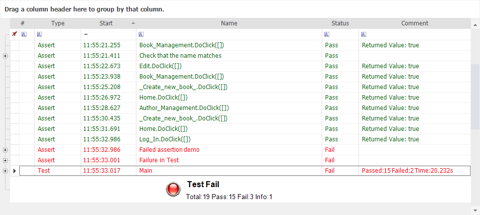
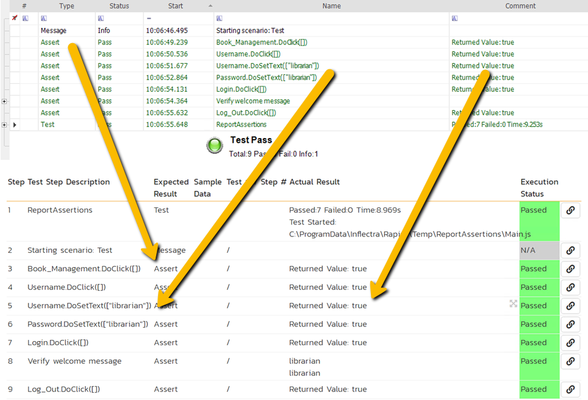
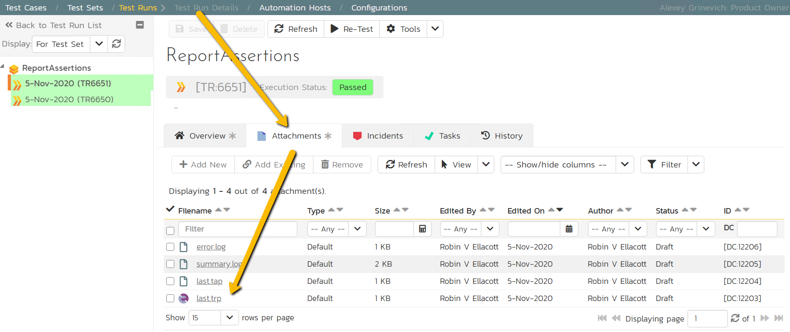
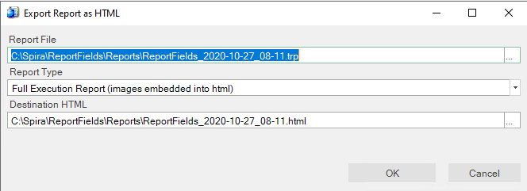

# Automated Reporting

## Purpose

Each time you playback a test, Rapise **automatically generates a report** detailing the steps of the test, the data values used, and the outcome of each step.

## Usage

Execute your test using the instructions [here](playback.md).  When the test is complete a report file (ending in **.trp**) will open in the [Content View](content_view.md).  It will look like this:



The first row (with a white background) is used for [Report Filtering](report_filtering.md).  The rows below that each represent a step in the test.  The rows with green text represent success; the rows with red text represent failure. You can reposition the columns by dragging and dropping the column names.

## The Columns

- **#**: For displaying icons.
- **Name**: The test name.
- **Start**: The time the test step began executing.
- **Type**: Can be one of the following values: Test; Assert; Message.
- **Comment**: Assertions and messages have associated comments. They are displayed here.
- **Status**: Whether the step passed, failed, or was merely informational.

See also [assertions](assertions.md) for more information about possible type of report comparisons.

## Spira Column Mapping

Whenever the test is executed using the [RapiseLauncher](spiratest_integration.md#using-rapiselauncher) its results are uploaded to the [SpiraTest](spiratest_integration.md). The set of columns displayed by the [Test Run Details](https://spiradoc.inflectra.com/Spira-User-Manual/Test-Run-Management/#test-run-steps) view differs from Rapise Report Viewer, so the following mapping occurs:



There is always a source `.trp` file attached to the test run, you may find it to in the test run **Attachmens** tab:



So you may download it and open using Rapise to see the full featured automated test report.

### Custom Spira Column Mapping

You may have more fine grained control over SpiraTest column display by applying `tags` parameter to the [Tester.Assert](../Libraries/Tester.md#assert) function.

```javascript
	Tester.Assert(
		"Assertion Message",
		true,
		"Comment goes to ActualResult",
		{"expectedResult":"expected", "sampleData":"sampleData"}
    );
```
In this case [ReportViewer](report_viewer.md) shows two additional columns - **ExpectedResult** and **SampleData** and uses them to fill corresponding columns in the Spira test report.

> Note: Assertion message, ActualResult or SampleData may contain a reference to the Manual Test Step in format `[TS:X]`, where `X` is the number representing the Test Step ID. This is useful when you migrating manual test cases to automated scripts and want to keep the trace to manual test steps in the report.

## Report Formats

Whenever one runs a test, the report will be stored in the following formats:

1. `.trp` - default Rapise test report format. Contains all information, status and images. Rapise displays it using built in [Report Viewer](report_viewer.md).
2. `.tap` - pure text, **Test Anything Protocol** [formatted](tap) output. Usually saved as `last.tap`. It is a simplest way for integrating the test into external/custom execution pipelines.
3. `index.html` and `imageNNN.png` - flow output. It is saved into `<test folder>\Reports\<Date_Time>\` folder:
     

## Export Report

Report may be exported as `.xls`, `.pdf`, `.xps` or `.html` using the [Report](menu_and_toolbars.md#report) popup menu.

### Export as HTML Dialog

**HTML** export supports a number of templates. So if you do `Report/Export as HTML` you then have to specify the export format using the following dialog:



**Report File** - source `.trp` to be used for export.

**Report Type** - choose one of the following export templates:
* Full Execution Report (images embedded into html) - full report, combined in a single file.
* Full Execution Report (images saved as separate files) - same as previous, but all images are saved next to the main `.html` file.
* High level report (only test status) - short report containing only test-level status.

**Destination HTML** - path to the target `.html` file.

This type of export may also be done from **JavaScript** code.
```javascript
	var ldr = new ActiveXObject("Rapise.LogLoader");
	ldr.LoadTrp("Reports\\ReportAssertions_2020-11-04_15-20.trp");
	ldr.ExportAsHtml("C:\\Program Files (x86)\\Inflectra\\Rapise\\Extensions\\TrpExporter\\FullReportImgTpl.tt", "FullReport.html");
```

## Column Grouping

Report viewer enables grouping rows by column values. Just drag the column header to this section:


Use to order by the values in the chosen column.  The result of dragging the **Status** column over looks like this:


You can expand each item to see the corresponding report rows:


Drag the **Status** icon back to undo the sort:


## TODO Rows

Whenever **Name** starts with `TODO` the viewer automatically does the following:

* If report row **Type** is **Info** then it is highlighted in Yellow and TODO counter is incremented:

    

* If report row **Type** is **Assert** then it stays green or red, but TODO counter is still incremented.

If you hover over last execution status in Rapise main window, the tooltip would contain then total number of TODO items found in the report (i.e. TODO counter):


## See Also

- [Report Filtering](report_filtering.md)
- The report output file is specified in the [Settings Dialog](settings_dialog.md) (**Settings** > **ReportPath**).

