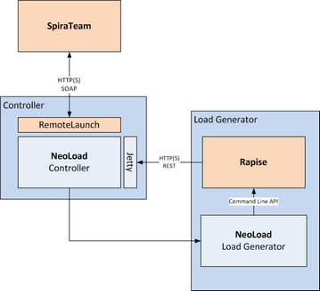
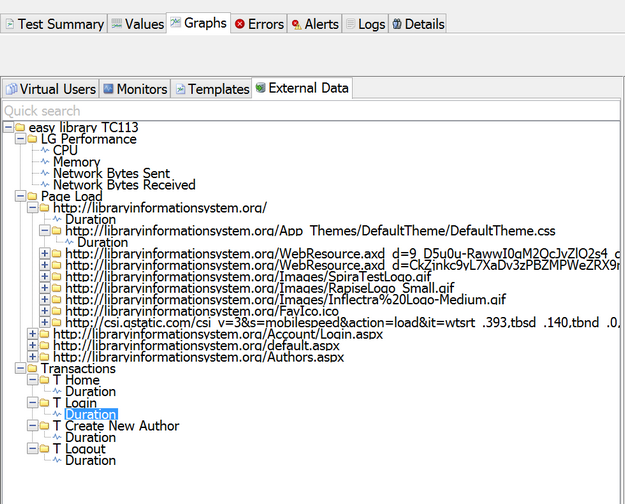
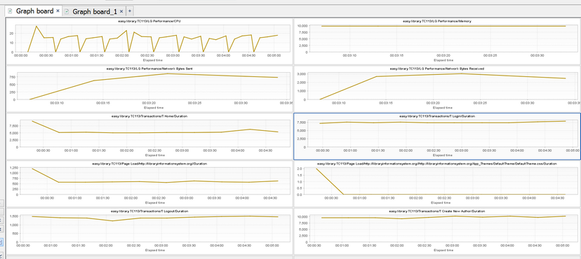
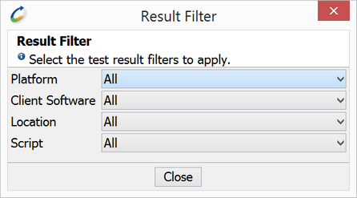

# Client Performance Monitoring

!!! important
    NeoLoad integration has been removed in Rapise 7.0.

## Concept and Architecture

The purpose of this integration is to satisfy the following use case.

> The tester wants to measure the speed of the user interface that a user would experience whilst performing a protocol-level load test:
>
> - How long does each transaction take whilst 1000 VUs are hitting the same system
> - The user interface could be web, mobile or thick client (e.g. ERP system)

The following describes the technical architecture that would need to be in place:



The process flow for the above architecture would be as follows:

1. User schedules the performance test in SpiraTest.
2. RemoteLaunch connected to the NeoLoad controller and SpiraTest initiates the start of the testing.
3. The NeoLoad controller sends commands to the NeoLoad load generators to start the performance scenario.
4. During the performance scenario, NeoLoad calls Rapise through its command-line to start a specific test
5. At specific points in the Rapise function test (which is grouped into transactions), timing code in the Rapise script (see next section) will call the NeoLoad REST API to report back the timing for the transaction block.
    - The NeoLoad controller will need to correlate each of the blocks with the appropriate transaction in the performance scenario.
6. At the end of the performance test, RemoteLaunch will read the entire performance test and send back the results to SpiraTest.

## NeoLoad Global Object

Rapise has a global object named NeoLoad which is capable of sending client performance metrics to the NeoLoad controller.


NeoLoad will display the received data in a both tree and graph views.

## NeoLoad Tree View



The root of the tree is the name of a script that was executed by Rapise. On the first level we have three groups:

- LG Performance – this is a folder of a load generator essential metrics captured by Rapise: CPU, Memory, Network Sent/Received bytes.
- Page Load – this folder contains nodes for each page and nested resource. Duration values are obtained using Window.performance structure. See also [http://www.w3.org/TR/navigation-timing/#processing-model](http://www.w3.org/TR/navigation-timing/#processing-model)
- Transactions – this folder contains counters for transactions defined by a script.

## Graph View

Each leaf node can be dragged to the graph view for visualization:



## Performance Filters

Performance results obtained from different runs can be filtered using result filter on the toolbar.


You can open the Results Filter dialogs by pressing `…` button.



- Platform is a combination of hardware – OS. Hardware is passed by a user script, OS is determined by Rapise automatically. E.g. hardware1 – Microsoft Windows 8.1 Pro.
- Client Software is Rapise.
- Location is supplied by a script. E.g. location1.
- Script is a combination of script name and time stamp. E.g.
- 


## NeoLoad Object API Reference

The methods of the global NeoLoad object are described [on this page](/Libraries/NeoLoad/).

## How to Use

In order to send performance metrics to NeoLoad you need to add a sequence of calls to your script.

First, connect to the NeoLoad. When this call is executed NeoLoad must be running a script, otherwise an error will be returned.

```javascript
NeoLoad.CreateClient("hardware1", "location1", "Broadcom 802.11ac Network Adapter \_2");
```

Let’s look at the following block:

```javascript
NeoLoad.CaptureHostPerformance();
NeoLoad.StartTransaction('T Home');
NeoLoad.CaptureBrowserPerformance(SeS('Log\_In').GetPageURL());
//Click on Log In
SeS('Log\_In').DoClick();
NeoLoad.CaptureBrowserPerformance(SeS('Username\_').GetPageURL());
NeoLoad.EndTransaction('T Home');
```

- CaptureHostPerformance call sends immediate values of CPU, Memory and Network load to the NeoLoad controller.
- StartTransaction/EndTransaction calls define a transaction with name ‘T Home’. Upon EndTransaction call the duration of it is sent to the NeoLoad controller.
- CalculateBrowserPerformance call sends page load performance metrics to the NeoLoad controller.

There is also a general call that can send any user-defined metric to the NeoLoad controller:

```javascript
NeoLoad.CapturePerformanceValue("First Level Folder", "Transaction1|Duration", "milliseconds", 120);
```

Components of the second parameters can be separated by |. It allows to add more levels to the tree.
