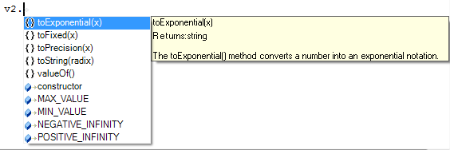

# Code Completion

## Purpose

Rapise provides **Code Completion** for class, method and field names.

## Usage

Begin typing a class, method, or field name. Press `CTRL+Space` to open a list of possible completions.


## Advanced

Rapise has built-in code completion logic that lets it suggest the available list of functions for a specific object. However since JavaScript is fundamentally an un-typed language, for the code completion to work, there are some tips and tricks that you can use.

Rapise scans for variable definitions when one saves the `.js` source file. So if anything goes wrong (no hints) then first thing is to save the file.

One may define a variable as simple as:

```javascript
var p;
```

In this example `p` is just a variable with undefined type. It may be used as number, string or object. So Rapise has no idea of how to deal with it. So if you type a dot after  `p.` no code-completion window appears.

There are several ways of giving Rapise a "hint" about the variable type:

## Static Assignement

First, is static assignment. Suppose you specify some constant value when defining a variable:

```javascript
var p = "some string";
```

In this case Rapise knows the type of `p`. So it would assist you when you type a dot `.` after `p`:


## Using Comments to Suggest the Type

In some cases variable type is not clear from its definition or assignments is not static:

```javascript
var v1 = input;
var v2;
```

To deal with such cases the code should be instrumented. For example, if we know that input is string and v2 will be used as number then we may explain it to Rapise by placing variable type using special comment: `/**var_type*/` right together with var definition. It should be placed right either between `var` keyword and variable name or right after an assignment operation (`=`), if any. I.e.:

```javascript
var v1 = /**string*/ input;
var /**number*/ v2;
```

So now Rapise will be able to display the list of available methods and properties:



Another common case is a function parameter. If you have function that is defined:

```javascript
function my_func(patient_index, patient_name)
{
}
```

The type of parameters `patient_index` and `patient_name` are not known, but may be explained in a similar way:

```javascript
function my_func(/**number*/ patient_index, /**string*/ patient_name)
```

So it becomes known to Rapise:


Code completion for variable names is useful when you have multiple variables or function parameters and need to type them quickly. In this case `CTRL+Space` key combination will bring up a list of variables and functions starting with just typed keyword.

## See Also

- [Source Editor](source_editor.md)
