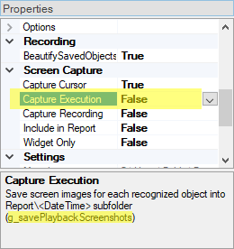

# Command Line

## Purpose
Rapise test scripts can be run from the **command line**.

## Usage
The form of the command is:

`c:\windows\syswow64\cscript.exe SeSExecutor.js <path_to_sstest_file> [evals*]`

where

*path_to_sstest_file* is a path to sstest file, e.g.  "C:\\Program Files\\Inflectra\\Rapise\\Samples\\SmarteATM\\SmarteATM.sstest"

*evals* (optional) is a statement like this:

**-eval:***`varname1`*=*value1;`varname2`*=*value2;...*

*varname* is a global variable associated with an option in the [Settings Dialog](settings_dialog.md).  Global variables are prefixed with a **g_.** The global variables under the **Execution** and **Recording** headings can be found by clicking on the corresponding option in the Settings Dialog (see below):

Other variables include:
*   `g_scriptPath`

*   `g_reportPath`

*   `g_objectsPath`

*   `g_configPath`

* any global variable defined in the JavaScript or RVL.

Exit Code:
•   0 indicates a pass
•   1 indicates failure

## See Also
*   [Settings Dialog](settings_dialog.md)
*   [KB113](http://www.inflectra.com/Support/KnowledgeBase/KB17.aspx) Running a Rapise script from the command-line on a 64-bit machine
