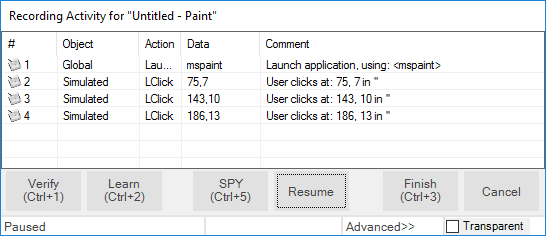

# Deal with a Simulated Object

## Sample Application

The color box of Microsoft's Paint utility is a compound object that contains color tiles surrounded by a containing box. To understand this completely, start `mspaint.exe` from the Rapise.

Steps:

1. Open a new test under Rapise.
2. Press the `Record` button on the application bar.
3. When the **Select an Application to Record** dialog appears, select the Run Application tab. Enter `mspaint` in the **Full path to application** edit box.  Press the `Run` button.

    > If you are unfamiliar with MS Paint, take a few minutes to play with it. In particular, notice the color selection box that appears on the upper-right of the application window.

    

4. Press `Ctrl+5` to spy on the UI.  Press `Ctrl+G` to spy on the Paint application. Notice several things about the behavior of the MS Paint application under the Object Spy.
      1. As you move the mouse inside the color box, the entire surrounding box will show a red highlight but the individual color tiles will not.
      2. Properties of the color box control have no clues on how to find a particular color.

This combination makes it impossible for Rapise to identify and learn the colors as integral objects.

The way in which Rapise can be _taught_ to deal with the color box is by "simulating" it.

In fact, Rapise will recognize these non-objects without you having to take particular action.  Let's discover this and what it means:

1. Open a new test under Rapise; call it `MSPaint`.
2. Press the `Record` button on the application bar.
3. When the **Select an Application to Record** dialog appears, clear all selection boxes in the library list box.  You will have to scroll that section of the dialog box to make sure all selections are clear.  We are choosing no loaded libraries so that Rapise will not be able to "cheat" and know about any objects on the screen.
4. Select the Run Application tab.  Enter `mspaint` in the **Full path to application** edit box.  Press the `Run` button.
    > **Note:** Applications that reside in `C:\windows\system32` can be started by their names because `C:\windows\system32` must be in the system path.
5. When the **Recording Activity** dialog is displayed, press **Learn** `Ctrl+2`
6. Do a small amount of things in Paint.  For example:
     1. Click on the red color in the palette.
     2. Click on the green color in the palette.
     3. Click on the blue color in the palette.
7. Look at the **Recording Activity** dialog grid.  It will be something like this:

    

    > Notice that the three clicks in the color box were recorded as **simulated** objects.

8. Press `Ctrl+3` to end the recording.
