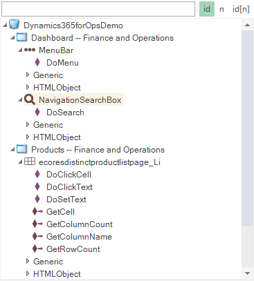

# Dynamics 365 for Operations

## Overview

Microsoft has created a new cloud-based SaaS-only combined ERP/CRM solution called **Microsoft Dynamics 365**. This provides a new web-based version of [Dynamics AX](dynamics_ax.md) (renamed Dynamics 365 for Operations), combined with a new web based version of Dynamics NAV (called Dynamics 365 for Financials) and an updated Microsoft Dynamics CRM Online.

This new integrated, ERP/CRM is provided solely through Microsoft Azure and is completely web-based. There are two main modules that Rapise has specialized support for:

1. **Dynamics 365 for Operations** – this is the subject of this section, please read on if you are testing these modules.
2. **Dynamics 365 for Sales** – this is a rebrand of [Dynamics CRM](dynamics_crm.md) and is covered in corresponding section.


## Recording a Dynamics 365 for Operations Test

Dynamics 365 for Operations is completely web-based (unlike Dynamics AX) and you use a web browser to access the user interface. Therefore when recording a test using Rapise, you use the same web browser libraries that you use to record other web tests:

- Most of the Dynamics 365 user interface will be tested using the **standard browser library** for your web browser of choice (e.g.  Internet Explorer HTML, Firefox HTML, and Chrome HTML).
- In addition, there are special controls inside Dynamics 365 that Rapise has specialized support for. For that reason you'll also see the **DomDynamicsAx** library added to your test as well as the browser one. This **DomDynamicsAx** library adds additional rules that identify certain Dynamics 365 objects to make testing easier.

When you record your first test, you'll see the following library selection code generated automatically by Rapise:

```javascript
g\_load\_libraries=\["%g\_browserLibrary:Internet Explorer HTML%", "DomDynamicsAx"\];
```

If you don’t see the **DomDynamicsAx** library listed in your test, then you will need to [manually add it](change_the_libraries_being_use.md).

## Recording and Learning Objects

During recording while you interact with Dynamics 365, Rapise captures actions and displays them in the recording dialog:



Some of these objects will be standard HTML DOM objects (e.g. hyperlink):


and others will be specific to Dynamics 365:


## Tips for Interacting with Objects

One of the most important UI elements inside Dynamics 365 is the multi-level menu bar:


The Dynamics 365 menu bar is used to quickly and easily navigate between different parts of the application and it is very common to need to interact with it in test scripts.

When you click on entries in the menu bar or simply learn the entire menu using **CTRL+2** you will learn the **DomDynamicsAXMenuBar** object:


In additional to the standard HTML object methods and properties, you have [the special functions that you can perform on the menu](/Libraries/DomDynamicsAXMenuBar/):

- **DoMenu(path, separator)** – selects the menu entries in specified path, using the specified separator (or semicolon if none specified).

Here is a sample test that was recorded using Dynamics 365 for Operations and Rapise:

```javascript
function Test()
{
    //Get the sample data from the database
    var conn = 'Provider=Microsoft.ACE.OLEDB.12.0;Data Source=SampleData.accdb';
    var sql = 'SELECT TEST\_VALUE FROM TEST\_DATA';
    Database.DoAttach(conn, sql);
    do
    {
        var testValue = Database.GetValue('TEST\_VALUE');
        if (testValue)
        {
            SeS('MenuBar').DoMenu("Modules;Procurement and sourcing;Purchase orders;All purchase orders");
            StartNewPurchaseOrder();
            FillPurchaseOrderForm(testValue);
        }
    } while (Database.DoSequential());
}

g_load_libraries=["%g_browserLibrary:Internet Explorer HTML%", "DomDynamicsAX"];

/** @scenario StartNewPurchaseOrder */
function StartNewPurchaseOrder()
{
    Global.DoWaitFor('New1');
    SeS('New1').DoClick();
}

/** @scenario FillPurchaseOrderForm */
function FillPurchaseOrderForm(data)
{
    Global.DoWaitFor('DIV1');
    SeS('DIV1').DoClick();
    SeS('DIV2').DoClick();
    //Click on DIV
    SeS('DIV3').DoClick();
    //Learned Vendor account
    SeS('Vendor\_account1').DoClick( );
    //Set Text
    SeS('dat').DoSetText(data);
    SeS('OK').DoClick();
}
```

## See Also

- [Microsoft Dynamics](microsoft_dynamics.md)
- [Demo: How to Create a PO in Microsoft Dynamics 365 for Operations](https://youtu.be/NKE1Lg5OgoQ)
- [Webinar: Testing Microsoft Dynamics 365 for Operations with Rapise](https://youtu.be/YMhT0GLNwUE)