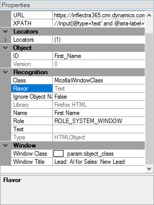
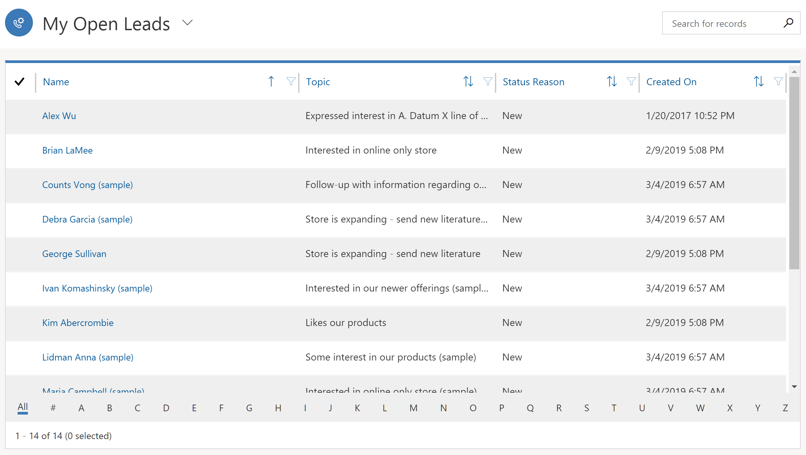
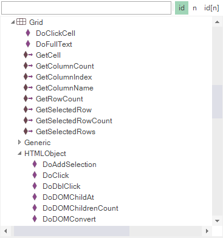

# Dynamics CRM

## Overview

**Microsoft Dynamics CRM** is a customer relationship management application from Microsoft, that provides sales, service, and marketing capabilities. Microsoft sells Microsoft Dynamics CRM separately from the ERP products. CRM is available either as on-premises software or as a
software-as-a-service offering called **Microsoft Dynamics CRM Online**.

Rapise can be used to test installations of Dynamics CRM both on-premise and online.

Latest version of Dynamics CRM is called Dynamics 365 for Sales. It is also supported.

## Dynamics CRM On-Premise


## Dynamics CRM Online


## Recording a Dynamics CRM Test

Both versions of Dynamics CRM (server and online) are completely web-based and use a web browser to access the user interface. Therefore when recording a test using Rapise, you use the same web browser libraries that you use to record other [web tests](web_testing.md):

- Most of the Dynamics CRM user interface will be tested using the **standard browser library** for your web browser of choice (e.g. Internet Explorer HTML, Firefox HTML, and Chrome HTML).
- In addition, there are special controls inside CRM that Rapise has specialized support for. For that reason you'll also see the **DomDynamicsCrm** library added to your test as well as the browser one. This **DomDynamicsCrm** library adds additional rules that identify certain CRM objects to make testing easier.

When you record your first test, you'll get the following library selection code generated automatically by Rapise:

```javascript
g_load_libraries=["%g_browserLibrary:Chrome HTML%", "DomDynamicsCrm"];
```

If you don’t see the **DomDynamicsCrm** library listed in your test, then you will need to [manually add it](change_the_libraries_being_use.md).

## Recording and Learning Objects

During recording while you interact with Dynamics CRM, Rapise captures actions and displays them in the recording dialog:


Some of these objects will be standard HTML DOM objects (e.g. hyperlink):



and others will be specific to Dynamics CRM:


## Tips for Interacting with Objects

The following unique objects are available within Dynamics CRM that Rapise has special support for:

### Dynamics CRM Grid

One of the the most important UI elements inside Dynamics CRM is the sortable, filterable grid:



The Dynamics CRM Grid is used in lots of different screens inside Dynamics CRM (e.g. Contacts, Accounts, etc.) and it is very common to
need to interact with it in test scripts.

When you record operations on such a grid or simply learn the entire grid using `CTRL+2` you will learn the `DomDynamicsCrmGrid` object:



In addition to the standard HTML object methods and properties, you have [the special functions that you can perform on the grid](/Libraries/DomDynamicsCrmGrid/):

- **DoClickCell()** - Clicks the specified cell when you specify the x-index, y-index, the type of click (left-click, right-click, etc.).
- **DoFullText()** - Returns the textual representation of the entire table.
- **GetCell** - Gets the text of the specified cell.
- **GetColumnCount** - Gets the number of columns in grid.
- **GetColumnName** - Gets the caption of a column.
- **GetRowCount** - Gets the number of rows in grid.
- **GetSelectedRow** - Gets the index of the selected row.
- **GetSelectedRowCount** - Gets the number of selected rows.
- **GetSelectedRows** - Gets the selected rows.

## See Also

- [Microsoft Dynamics](microsoft_dynamics.md)
- [Tips & Tricks for Rapise and Dynamics 365 for Sales](https://www.inflectra.com/support/knowledgebase/kb277.aspx)
- [KB: How to automate testing of Unified Service Desk for Microsoft Dynamics 365](https://www.inflectra.com/Support/KnowledgeBase/KB362.aspx)
- [Webinar: Testing Dynamics CRM & 365 for Sales using Rapise](https://youtu.be/49DpIhpFLx8)