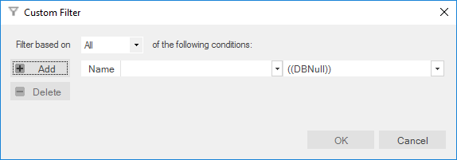

# Enter filter criteria for... Dialog

## Purpose

Allow more than one [filter criteria](report_filtering.md) for the same column.

## How to Open

In the [Report Viewer](report_viewer.md), open the drop-down menu for one of the [filter cells](report_filtering.md); select the **Custom** option (see below):

## Conditions

You may specify as many conditions as you like.  Each condition has two properties, a **Matching Criteria** on the left and a **filter value** on the right.  The **filter value** is a string, and the **matching criteria** specifies what constitutes a match.   For more details, look [HERE](report_filtering.md).

## Filter Aggregation

There are two ways you can aggregate / combine filter conditions:

- **All**:  All conditions must be true to constitute a match.
- **Any**: At least one condition must be true to constitute a match.

## Buttons

- **Add**: Add a extra condition row.
- **Delete**: Delete the selected condition.

You can select a condition by clicking on the field name to the left of the matching criteria:

- **OK**: Close the dialog and apply the filter.
- **Cancel**: Close the dialog.  Do not apply the filter.
