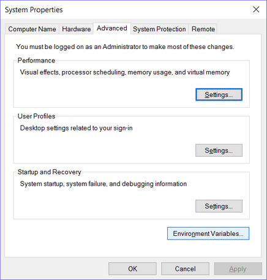
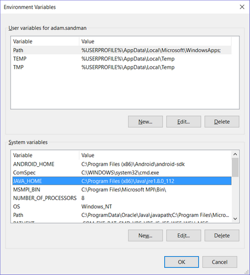
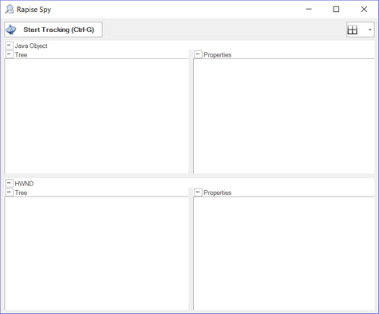
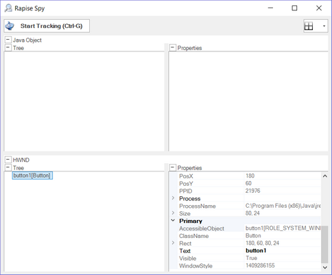
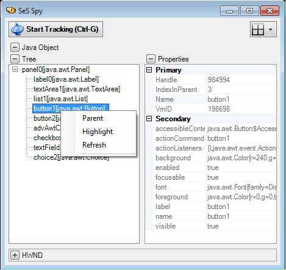
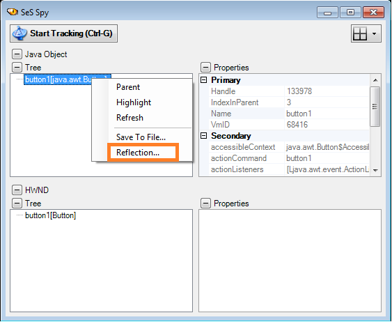
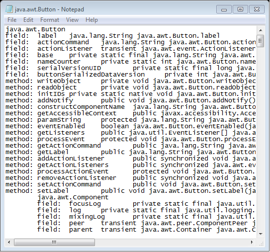

# Java AWT/Swing Testing

## Purpose

Rapise supports the testing of Java applications using either the Abstract Window Toolkit (AWT) or Swing graphic user interface toolkits. For maximum flexibility, Rapise can connect to your choice of JVM.

## Java Bridge Installation

In order to use a particular Java Virtual Machine (JVM) with Rapise you need to install Java Bridge into it. Installation process consists of several simple steps:

1. Click on the `Settings > Java` button. This will launch the Java Bridge installation dialog:

    

2. Choose target JVM in the list of available Java machines and press Install button

3. Verify that the installation is successful

To verify that the bridge installed correctly, check that the following files have been installed inside your Java VM (typically found at `C:\Program Files (x86)\Java\jre1.x.x_xxx`):

* `lib\accessibility.properties`
* `lib\ext\jaccess.jar`
* `lib\ext\smartestudio-bridge.jar`

If you don't see **all three of these files** then it means the bridge was not installed correctly.

## Troubleshooting the Configuration

To help you make sure that your environment is correctly setup and also to help you try out Rapise, we have a sample application called AUTJava (AUT = **A**pplication **U**nder **T**est) that can be found in the folder:

`C:\Users\Public\Documents\Rapise\Samples\Java\AUTJAVA`

To run the application, right-click on the x86run.cmd file and choose **Run as Administrator**.

If the application doesn't appear correctly then you may need to set the `JAVA_HOME` environment variable.

To do this, open up the Windows control panel and choose `System > Advanced System Settings`:

Click on the **Environment Variables** button:

Click on the option to add a **System Variable** and then add the following:

* Variable = JAVA_HOME
* Value = C:\Program Files (x86)\Java\jre1.x.x_xxx

*(you will need to match the location of your actual Java VM)*

Now you should be able to launch the AUTJava sample application.

To verify that Rapise is configured correctly, click on the SPY menu in Rapise and choose **Java**.

Then click on the main **Spy** icon and the Java Spy will start up:

Click the CTRL+G button combination to start tracking and then move the mouse over one of the buttons in the sample application and click CTRL+G again.
You should see the following:

Which shows that Rapise is able to see the AWT button (in this example) and its properties. However if you see the following instead:

it means that you didn't run the sample application using **"Run as Administrator**", close the application and try again using **"Run as Administrator"** and you will see:

You are now ready to start testing your real application. Make sure to also start it using **"Run as Administrator**".

## Analyzing the Java Application using the Java Spy

With Spy you can walk along the tree of Java objects in your application.

## Save to File

You can save the Spy data for a particular node and all its descendants to a text file.

## Reflection Information

You can save reflection information for a java class used to implement a GUI control.

