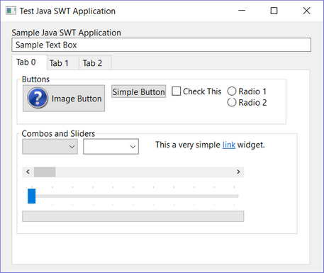

# Java SWT

## Overview
The **Java SWT** GUI library is an alternative to Swing developed by the **Eclipse** foundation and it provides Java applications the ability to access the **native GUI libraries** of the operating system using JNI (Java Native Interface) in a manner that is similar to those programs written using operating system-specific APIs. Programs that call SWT are portable, but the implementation of the toolkit, despite part of it being written in Java, is unique for each platform.

Rapise supports the testing of applications written using Java **Standard Widget Toolkit (SWT)** using its **JavaSWT** extensions library (which is based on the UI Automation technology in Windows). 

Since SWT displays applications using native Windows controls it doesn’t need the Java Access Bridge to be installed (unlike Java AWT/Swing applications).

## Sample Application

In the Samples section of the Rapise Start Page you should see our sample Java SWT AUT:

You can use this application with Rapise to try out the Java SWT testing capabilities:

*   You should record tests using the special **SWT** library

*   You should use the [UIAutomation Spy](object_spy_uiautomation.md) for inspecting objects.
