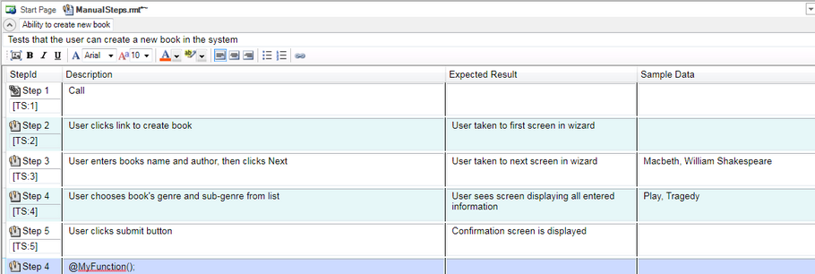

# Manual Test Editor

## Screenshot

## Purpose

The **Manual Test Editor** lets you create and edit manual test cases that are stored in [Spira](spiratest_integration.md). These manual test cases contain a high level description of the test case as well a detailed set of steps and associated expected results that make up the manual test script. These manual tests can be [executed manually](manual_playback.md) in Rapise (or in Spira) as well as used as the basis for creating a related automated test script. Such automated test scripts may be linked to individual test steps by means of the [test scenario](scenarios.md) approach.

## How to Open

You can open the **Manual** toolbar by either clicking on the **Manual Steps** icon on the main [Main Toolbar](menu_and_toolbars.md#main-toolbar) or clicking on the **ManualSteps.rmt** file in the [Files](test_files_dialog.md) tab. The [Manual Toolbar](menu_and_toolbars.md#manual-toolbar) will be displayed whenever you have the Manual Test Editor open.

## Test Case Name/Description

This section lets you edit the name and long formatted description of the test case. The rich text editor lets you choose the font name, font size, text color, highlight color, style (bold, underline, italic) as well as provides easy ability to add links, bullets and numbered lists.

In addition there is a button that lets you [add screenshots](image_capture.md).

## Test Step Editor

This section lets you add, edit and delete test steps from the manual test case. Each of the test steps contains four fields:

* **Step ID** - this contains the position number of the test step (e.g. step 1) as well as the ID of the test step as it exists in Spira. If you click on the [TS:xxx] label it will automatically copy this into the Windows clipboard. This allows you to easily paste the ID of the test step into your automated test scripts which allows Rapise to [report back test results to Spira](spiratest_integration.md) against specific test steps.

* **Description** - this is a description of the test procedure that the tester should perform.

* **Expected Result** - This is a description of the expected result that should be observed if the system being tested performs correctly.

* **Sample Data** - This is an optional field that contains any sample data that should be used in the test

Each of the fields provides a rich text editor lets you choose the font name, font size, text color, highlight color, style (bold, underline, italic) as well as provides easy ability to add links, bullets and numbered lists. In addition there is a button that lets you [add screenshots](image_capture.md) to the test step.

For ease of editing, you can navigate between the rows and columns using the **ALT + Arrow keys** on the keyboard.

## Automating Test Steps

Sometimes you have a primarily manual test case that you want to automate certain steps of. For example you may want to automate the setup of the test data or login to the application before carrying out manual testing. Such a test is called a [semi-manual test](semi_manual_testing.md).

To do this, you enter the syntax **@FunctionName();** in the Description box of the test step. Then when you run the test, that step will be executed automatically. The **@FunctionName();** refers to a JavaScript [user function](defining_functions.md) called `function FunctionName()` in the `User.js` file.

## For example

