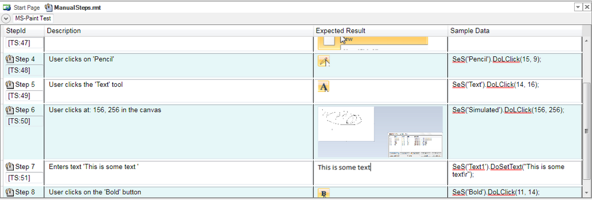
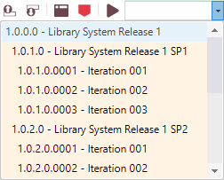
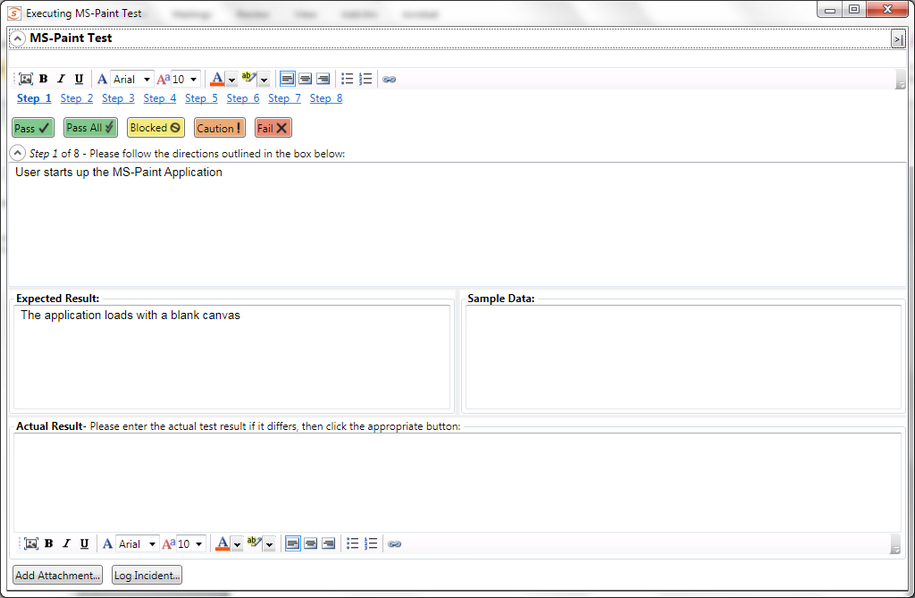
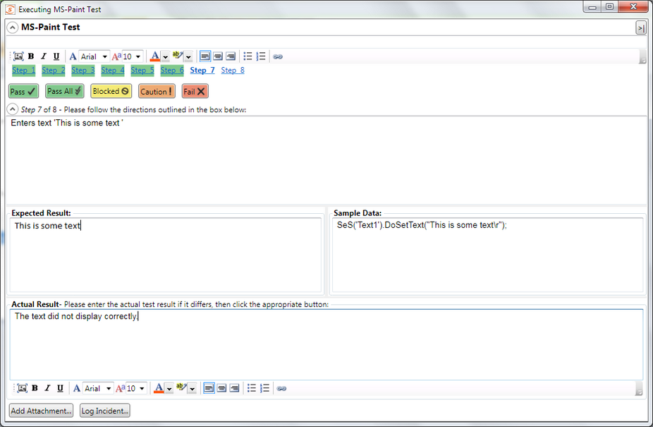
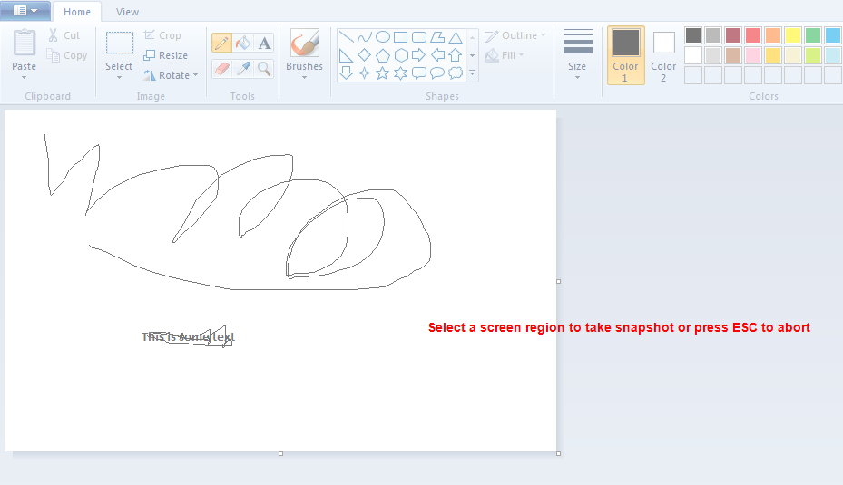
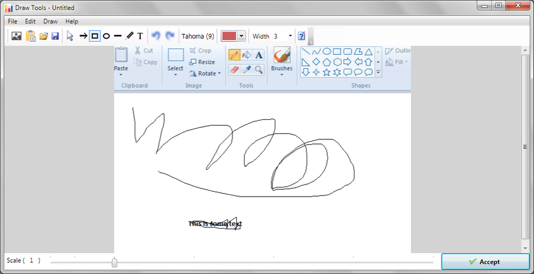
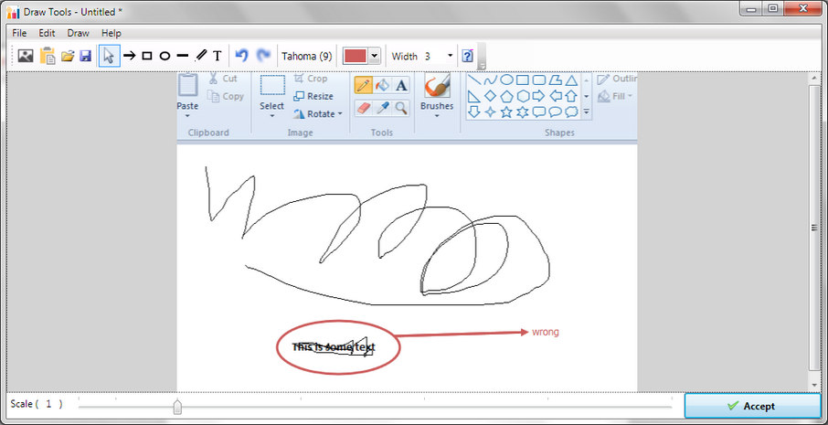
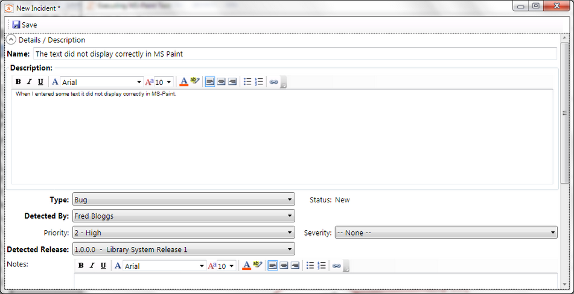
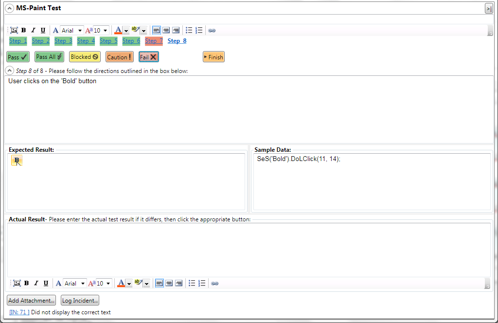
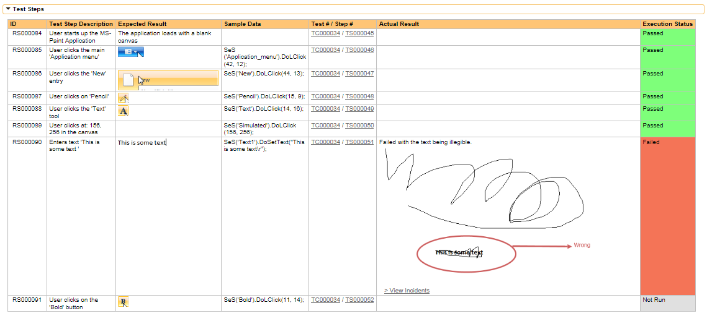

# Manual Testing: Playback

## Purpose

As described in the main [Manual Testing](manual_testing.md) topic, sometimes it is not possible to automate the testing of a specific application, however Rapise is also a powerful manual testing tool that lets you execute manual test cases stored in [SpiraTest](spiratest_integration.md).

The advantage of using Rapise to execute the manual tests (instead of just using SpiraTest itself) is that Rapise can display the [execution window](manual_playback.md) as a small minimizable dialog box that gets rid of the need to have two screens (one to display the test and one to test the application). Also Rapise provides superior [image manipulation tools](image_capture.md) over those available in a web application.

## Step 1 - Open the Manual Test

Using the MS-Paint example manual test that [we created previously](manual_testing_playback.md), open up the test in Rapise. Click on the `Tools > Manual Steps` menu and you should see the list of test steps:

Now that we have the test opened, we can start the playback.

## Step 2 - Executing the Manual Test

Choose the Release from the list of those available in the project:

Then click on the '**Execute'** icon to start manual test execution. That will bring up the [manual playback](manual_playback.md) screen:

On this screen, we shall follow through the steps listed in the test case. This involves opening up MS Paint, creating a new canvas, adding some lines using the pencil and then adding some text using the text tool. As you perform these steps, click on the `Pass` button to indicate that each step has passed. You can also minimize the manual playback screen by clicking the `>|` button.

Once you get to Step 7, we shall pretend that MS Paint failed to display the text correctly. Enter in the Actual Result a message to that effect:

Next we shall attach a screenshot of what actually happened and log a test failure and associated incident / defect.

## Step 3 - Capturing and Annotating a Screenshot

Click on the **Image icon** in the rich text editor associated with the **Actual Result** text box. That will bring up the [Drawing Tools](image_capture.md) screen that asks you to draw a rectangle to select a portion of the current screen to capture:

If the MS Paint application is not in the foreground, just click ESC on your keyboard to abort, rearrange your windows and then try again.
Once you have selected the rectangle, the drawing tools will display your selected image in the image editor:

You can now use the annotation tools to add labels, text and other items to explain the issue that you found:

In the example above, we added a red ellipse, arrow and text to mark the issue that was seen in MS-Paint. Once you are happy with your image, click **Accept** and the image will be included in the test Actual Result:

Now we can [log an incident](incident_logging.md) that is associated with this test failure.

## Step 4 - Logging the Incident / Defect

Click on the '**Log Incident**' button to display the new incident entry screen:

Choose the **type** of incident, enter the **name**, **description**, **priority, detected release** and any other required fields as defined by the workflow in the project that you are connected to. Once you have entered in the various fields, click the `Save` icon in the top left.

This will return you to the [manual execution](manual_playback.md) screen with the **Incident ID** \[IN:xxx\] and **name** displayed at the bottom. Now click on the `Fail` button and the test case will be marked as failed:

Finally, click on the **Finish** button and the results will be posted to [Spira](spiratest_integration.md).

## Step 5 - Viewing the Results

Now to view the results in Spira, click on the [View > View Manual Test in Spira](spira_dashboard.md) menu. Then under the 'My Created' test cases, click on the link for the test case you execute. That will bring up the test case in Spira. Now click on the 'Failed' hyperlink in Spira and the new test run will be displayed:

If you scroll down, you can see the individual test steps that were executed, with the associated actual result (including the captured screenshot):

If you click on the **Incidents** tab, you can also see the new incident that was logged, linked to this test run:

Congratulations! You have now successfully executed a manual test using Rapise.

## See Also
* [Manual Testing](manual_testing.md)
* [Manual Recording](manual_testing_recording.md)
