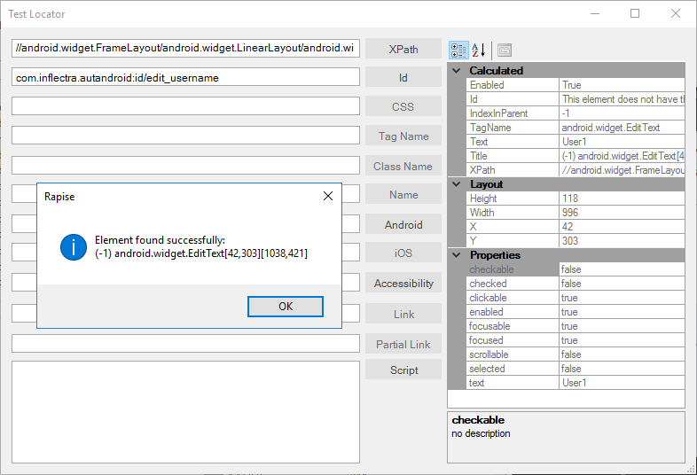

# Mobile Test Locator Dialog

## Purpose

This dialog box lets you create a test locator for mobile applications using one of the supported methods (XPath, ID, etc.) and display the results of using that locator interactively.

## How to Open

You open this dialog from the [Mobile Spy](object_spy.md) by clicking the **Test Locator** button on that dialog.

## How to Use

To use this dialog, you simply choose which type of locator you wish to test (in the example above we are using XPath on an iOS device) and click the button. The properties discovered from using this locator on the device in question will be displayed in the right panel.
The following locator types are available:

- **XPath** - This allows you to enter an XPath selector that uniquely locates a specific element in the mobile object hierarchy
- **Id** - This allows you to enter the ID of a specific object and test to see if it can be found.
- **CSS** - For mobile website testing only, this lets you enter a CSS selector that can uniquely locate an object
- **Tag Name** - This lets you find elements by their Tag Name field. For web testing this is the name of the DOM element.
- **Class Name** - This lets you find elements by their UI Component Type
- **Name** - This lets you find elements by their Name field
- **Android** -  This lets you enter a string corresponding to a recursive element search using the UiAutomator Api (Android-only)
- **iOS** -  This allows you to enter a string corresponding to a recursive element search using the UIAutomation library (iOS-only)
- **Accessibility** - This lets you enter a string corresponding to a recursive element search using the Id/Name that the native Accessibility options utilize.
- **Link** - Based on the WebDriver standard, it lets you find hyperlinks using an *exact match* of the link anchor text
- **Partial Link** - Based on the WebDriver standard, it lets you find hyperlinks using a *partial match* of the link anchor text
- **Script** - For iOS testing, this lets you enter raw script that will be sent to the iOS device to find the element
