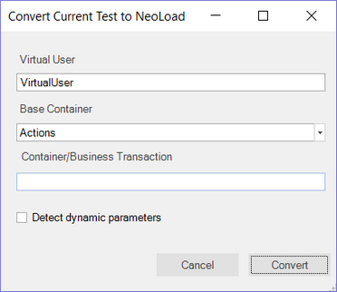

# NeoLoad Convertor Dialog

!!! important
    NeoLoad integration has been removed in Rapise 7.0.

## Purpose

The purpose of this dialog is to allow you to convert a functional test script from Rapise into a protocol-based performance script that can be executed using the [NeoLoad](neoload_integration.md) performance testing tool from Neotys.

## How to Open

Use menu `Tools > Convert to Neoload`.

## Virtual User

In this field, you need to enter the name of the virtual user to create in NeoLoad:

- The default value is "VirtualUser"
- If the name is already used, then it is automatically renamed using “_X” suffix, with X an integer incremented.
- If the name has invalid characters then they will be escaped as an underscore (_).

## Base Container

This specifies the base container  where we want to start the recording (Init / Actions / End)

- The default value is Actions.

## Container/Business Transaction

This is used to specify the current recording container in NeoLoad. It is just based on a single level. There is no way to specify a tree of containers.

- The default is no container.
- If the name is already used then it will be made unique by adding \_1, \_2, etc.
- If the name is empty then no container will be used.

## Detect Dynamic Parameters

When you check this box, Rapise tells NeoLoad to scan the protocol traffic to look for known dynamic parameters (e.g. Session IDs, ASP.NET ViewState) that change on each HTTP request and need to be parameterized by NeoLoad to ensure the performance scripts are robust and well-defined (v.s. having a hardcoded Session ID).

## Actions

- **Convert** will start the Rapise &gt; NeoLoad test conversion process
- **Cancel** will abort the conversion and return you to Rapise
