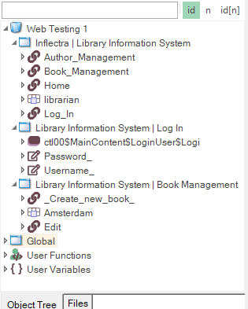
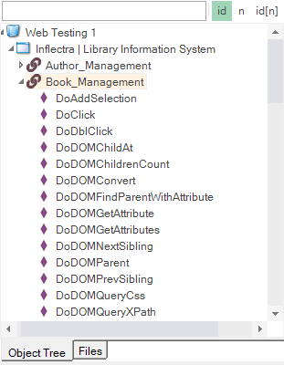

# Learning

## Purpose

Objects are the controls and items on the screen of the AUT.  **Learning** an object refers to the process of Rapise collecting enough information about the on-screen item to be able to reference the item when the test script is run without ambiguity and regardless of its location on the UI.

When Rapise **learns** an object, it records the object's type, its name and how to find the object again (locator).  It saves everything it learns to the script so that the object can be identified when the test is run.  Rapise gives the object a simple name so that you can easily refer to it later if you decide to modify the script.

## Usage

Objects are learned in three ways: (1) automatically during recording, (2) manually using Learn button, (3) using the [Spy](object_spy.md) tool.

## 1. Automatic Learn

During a Recording session, Rapise learns about each object with which you interact.  For details, see [Recording](recording.md).

## 2. Manual Learn

1. Open the **Recording Activity Dialog**. Instructions are [HERE](recording_activity_dialog.md).
2. Place your mouse over the object you wish to learn.  It should become surrounded by a purple box.
3. Press ++ctrl+2++.
4. You will see a new entry in the Recording Activity Dialog, signifying that the object was learned.

## 3. Spy Tool

During a Recording session, you can also click on the **Spy** button inspect the object hierarchy of the application you are testing. The Spy lets you pick specific objects that might not be visible on the screen, or may be parent/child objects of the one highlighted. When you have found the correct object in the Spy, you can use the **Learn Object** button inside the Spy to add it to Rapise's learned object list.

## The Object Tree

Regardless of how you learn the object, it will be displayed in the [Object tree](object_tree.md):



Each object has various properties and actions that can be performed on it. Expanding the object name lets you see the available actions and properties:



Everything Rapise learns about an object is saved in **saved_script_objects** array. You can see this variable defined in the `Objects.js` file that will be listed in the Files tab of the Rapise. The following shows what Rapise saved about the "Please enter your name" text box in the [Tutorial: Windows Testing](twodialogs_sample.md):

```javascript
"Please_enter_your_name_": {
    "locations": [
        {
            "locator_name": "UIAutomation",
            "location": {
                "location": "param:location",
                "window_name": "param:window_name",
                "window_class": "param:window_class"
            }
        }
    ],
    "window_class": "#32770",
    "object_text": "",
    "object_role": "param:object_class",
    "object_class": "Edit",
    "version": 0,
    "object_type": "UIATextBox",
    "object_flavor": "Text",
    "object_name": "Please enter your name:",
    "object_library": "UIAutomation",
    "window_name": "Inflectra Rapise Two Dialogs Sample",
    "location": "Inflectra Rapise Two Dialogs Sample/Please enter your name:[1]"
}
```

## See Also

- [Recording](recording.md)
- Learning invisible  and [Simulated Objects](simulated_objects.md) is slightly more complicated.  You can find information on both in the [Recording Activity Dialog](recording_activity_dialog.md) section.
- [Learn Object](learn_object.md)
