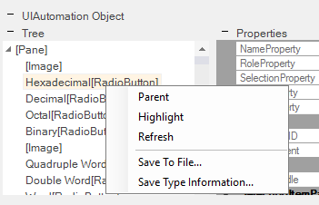

# UI Automation Spy

## Purpose

The **UIAutomation Spy** is used to inspect applications that contain Microsoft UIAutomation objects (e.g. Windows Presentation Framework, Silverlight or Java's Standard Widget Toolkit running on Windows).

## How to Open

In the main menu select `Tools > Spy > UIAutomation`. Then on the toolbar click `UIAutomation Spy` button.

## Features

The UIAutomation Spy has the following features:

- The **Tree** pane lets you view the hierarchy of UIAutomation objects available in the application
- The **Properties** pane lets you view the exposed properties of the highlighted UIAutomation object
- The **Learn Object** option is displayed when you use the Spy during recording and lets you pick specific [objects to learn](learn_object.md).

## Commands

In addition to viewing the object hierarchy and object properties, you can perform the following tasks:

- **Parent** - This selects the parent object of the one displayed
- **Highlight** - This will attempt to Flash (highlight with a red rectangle) the object selected in the Spy.
- **Refresh** - this simply refreshes the Spy view to reflect any changes that might have occurred in the application.
- **Save to File** - this will save the properties of the currently selected object to a text file.
- **Save Type Information** - this will save information about UI Automation object properties and patterns to a text file.

## See Also

- [Object Spy](object_spy.md)
- [Microsoft UIAutomation](http://support.microsoft.com/kb/971513/)
