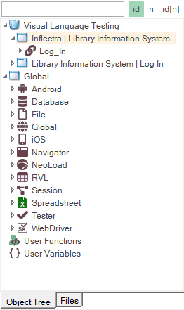

# Object Tree View

## Purpose

Display learned objects.

## How to Open

The **Objects** dialog is part of the [Default Layout](restoring_the_default_layout.md).

## Filtering

Object Tree has build in filtering and display mode switches.

* Filter - quick filter to narrow down range displayed in the object tree. Updates the tree while you type. If you want to cancel the filtering then simply remove everything from this input box.
* Display modes switch:
  - `id` - show object IDs in the tree.
  - `n` - show object names in the tree.
  - `id[n]` - show each object in format `object_id [ object_name ]` in the tree.

## Context Menu (root node)

Right click the **Object Tree** node to see:

* **Refresh** checks for new objects to display.
* **Collapse all** collapses the entire object tree.
* **Expand all** expands the entire object tree.

## Context Menu (window)

Right click the **Window** node to see:

* **Flash** opens the application/url where the object is located.  A frame will blink around the window.
* **Remove** remove window and all contained objects.

## Context Menu (object)

Right click on an object in the **Object Tree** dialog to see:

* **Flash** opens the application/url where the object is located.  A frame will blink around the object to show you where it is on the page.
* **Re-Learn** will open up the [Recorder](recording.md), allowing you to re-learn the object. This is useful if the AUT has changed and the object definition will no longer correctly locate the object.
* **Remove** simply removes the selected object from the tree.
* **Clone** makes a copy of the object definition and adds the cloned version into the tree. You can then make changes to the cloned copy.
* **Add Parameter** opens up a dialog box that lets you add a custom parameter to the learned object definition (stored in the `Objects.js` file).
