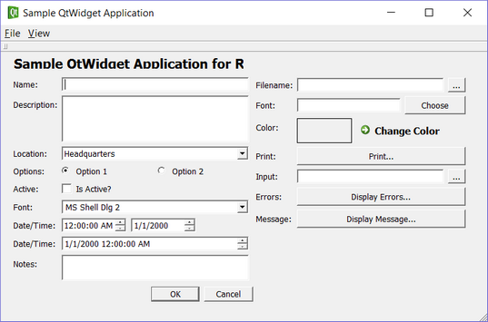

# Qt Framework

## Purpose
Rapise includes support for testing applications written using the Qt Framework written using QWidget controls.

## Usage
Rapise fully supports the test automation of Qt based applications. To ensure that Rapise can access the UI elements and properties in the Qt application, MSAA (Microsoft Active Accessibility) support for your Qt application must be enabled. This provides additional information on Qt UI elements to automation software like Rapise and can be accomplished by shipping and loading the "Accessible Plug-in" included in the Qt SDK (Software Development Kit) with the Qt application under test (see below).

**Loading Accessible Plug-in for your Qt application:**

1. Copy the "**accessible**" directory (and all its contents) from the **Qt SDK** (used to build the application under test) installation folder to the folder of the automated application (e.g. “**Program Files/Your-Application/plugins**”). If you do not have access to the Qt SDK which the Qt application is developed with, please contact the developer of the application and request the "accessible" directory from him.

2. Create a file called "**qt.conf**" (or append if the file already exists) in the root directory of the automated application (e.g. "**Program Files/Your-Application**") with following content (copy and paste the following two lines):

```
[Paths]
Plugins = plugins
```

## Sample

In the Samples section of the Rapise Start Page you should see our sample Qt Framework AUT:



You can use this application with Rapise to try out the Qt Framework testing capabilities:

*   You should record tests using the special **Qt Framework** library

*   You should use the [Accessible Spy](object_spy_accessible.md) for inspecting objects.
