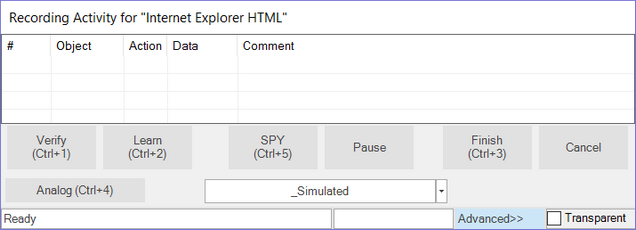
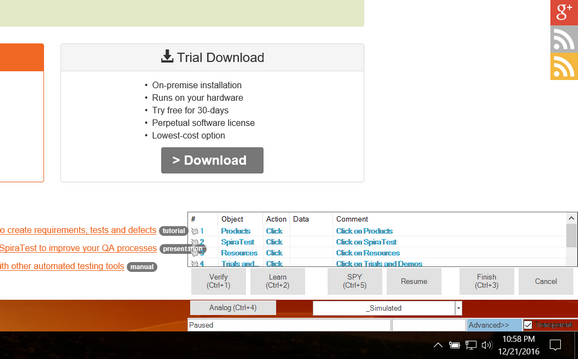

# Recording Activity Dialog

## Purpose

The **Recording Activity Dialog** is used for [Recording](recording.md), Analog recording ([absolute](absolute_analog_learning.md) and [relative](relative_analog_learning.md)), [Object Learning](object_learning.md), and creating [Simulated Objects](simulated_objects.md).

## How to Open

This dialog is opened slightly differently depending on the type of test
being recorded:

* **Web Testing** - When you click on the Record / Learn button in the Test ribbon, this dialog will be displayed.

* **Mobile Testing** - When you click on the Record / Learn button in the Test ribbon, this dialog will be displayed.

* **Other Testing** - After selecting the application to be recorded in the [Select an Application to Record](select_an_application_to_record_dialog.md) dialog, this dialog is displayed.

## Advanced Mode vs. Standard Mode

When you first open the dialog, it will be displayed in **Standard** mode:

This mode shows the most widely used options and is normally sufficient for most recording needs.

However if you need to do analog recording or you want more control over the type of object being recorded, you can click on the **Advanced** link to switch to Advanced mode:

Clicking on the Advanced link will switch it back to **Standard** mode.

## The Grid

As you interact with the AUT (**A**pplication **U**nder **T**est), your actions are recorded in the grid of the **Recording Activity dialog**.  The following screenshot shows the Recording Activity dialog after two interactions with [www.google.com](http://www.google.com): (1) first, **Inflectra** was entered into the query text box and (2) the **Google Search** button was then pressed.

## Context Menu

If you right click in the grid, you'll see a context menu with three
options:

* **Delete Action** removes the selected row.
* **Edit Action** opens the **Action Editor Dialog**.  This is also opened by double-clicking a grid entry.

* Press **Try Action** and Rapise will execute the action.

## Standard Mode Features

The following options are available in the dialog in both modes:

* **Verify** (Ctrl+1) - Press to open the [Verify Object Properties](verify_object_properties.md) dialog.

* **Learn** (Ctrl+2) - Use to [learn](object_learning.md) an object. Place the mouse cursor over the object you wish to learn.  It should become highlighted with a purple box.  Press Ctrl+2 while the object is highlighted.  You will see a line added to the Recording Activity dialog, signifying that the object was learned.

* **SPY** (Ctrl+5) - The Spy Button opens the **Object Spy dialog**. The Object Spy dialog allows you to view the state of the objects in your program.  Viewing object state is called [Object Spying](object_spy.md).  The Object Spy dialog is described [here](ses_spy_dialog.md). You can also use the SPY button to **learn an object** that is not visible or covered by another object.

* **Pause** - The Pause Button temporarily stops Recording.  Any interacting you d* with the AUT is ignored.  When you press the Pause Button, the title of the button changes to **Resume**.  Press the **Resume** button to continue recording.

* **Finish** (Ctrl+3) - The Finish button ends the Recording session.
The dialog is closed, and the information collected during Recording is
used to create a script.  The script is displayed.

* **Cancel** - The Cancel button stops Recording, closes the dialog, and
discards any actions recorded or objects learned during the Recording
session.

## Advanced Mode Features

The following additional features are available in Advanced mode:

* **Analog** (Ctrl+4) - The Analog button begins [Analog Recording](analog_recording.md).  Analog Recording tracks mouse movements, keyboard inputs, and clicks.  To end Analog Recording, press **CTRL+Break**

* **Simulated Drop-Down Menu** - An object can be learned if it matches a rule specified in the [Recording/Learning libraries](recording_library.md) available. The drop-down menu lists the possible rules for learning objects in the current application:

If you cannot learn an object with one library rule, try another in the list.  Create a **Simulated Object** only if the other, more flexible alternatives have been exhausted.

**To learn an object using a specific library**

1. Double click on a rule in the drop down list.  The button text should change to the text that you selected.

2. Press the button.

3. Select an object on the screen and make sure it is highlighted with a rectangle.

4. Press **Ctrl+2** to learn the object.

## Transparent Option

While the Recording Activity (RA) dialog is open, it is always on top. The Transparent checkbox makes the RA Dialog transparent so that you can interact with objects behind it.  The image below illustrates the difference:

When you click the **Transparent** option, it will look like the following:

The main advantage of this mode is that you can click in the area where the RA dialog is displayed and the clicks will be sent through to the AUT.
