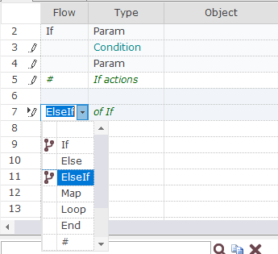
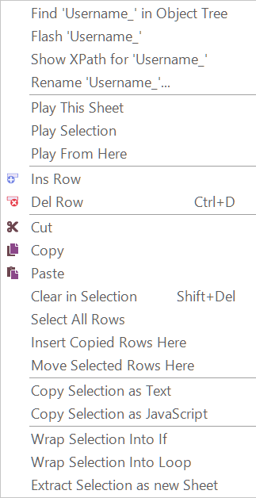
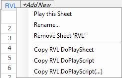
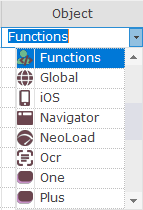

# RVL Editor

## Purpose

[Rapise Visual Language](visual_language.md) Editor

## How to Open

Use the **RVL** button on the main toolbar to open an RVL (`.rvl.xlsx`) file. The file will be opened by the **RVL Editor** in the [Content View](content_view.md).

## Features

Editor has support for all RVL statements including

- [Variables](../RVL/Variables.md),
- [Actions](../RVL/Actions.md),
- [Assertions](../RVL/Assertions.md),
- [Maps](../RVL/Maps.md),
- [If-Else](../RVL/IfElse.md),
- [Loops](../RVL/Loops.md)

statements.

RVL is a recordable language. Rapise recorder is translates captured actions to objects stored in the [object repository](object_tree.md) and a set of actions. Each recorded chunk may be inserted into desired place in the selected sheet:

Usually recording is with together with scripting and, maybe, some JavaScript for advanced tasks.

## RVL Scripting

In addition to recording one may use RVL editor for authoring scripts. You may drag&drop actions from the Object Tree into the RVL. Also RVL editor is both keyboard and mouse friendly. You may either type whole or parts of commands and rely on auto-completion OR simply select a dropdown in each cell of the row.

When writing or modifying a script it is recommended to go left-to-right for script creation.

## Auto Completion

RVL Editor supports Auto completions. For example, if you type `I` in the flow column:

And hit `Tab` key the whole **If** statement is created:

> **Note**: `Tab` is a trigger for auto-completion. If you use cursor keys or mouse to leave the cell then auto completion will not be executed.

If you go to last line and change **End** with **ElseIf**

then alternative branch is appended:

Similar logic works for Params, Conditions, Maps, Loops, Assertions and so on.

## Action Params

When you select an action from the list **RVL Edtior** automatically fills default action params. For example, if we choose: 

And press `Tab` after `DoLaunch` **RVL Editor** fills default param:

`DoLaunch` has one required parameter `cmdLine`. Also it has a number of optional parameters. They are not added by default to make script more concise. However, you may need all or some of them. So you may add them by pressing `Params` button on [RVL Toolbar](menu_and_toolbars.md#rvl-toolbar):

It is also possible to add params one-by-one using the dropdown in the **ParamName** column:

## Full Line Comments

Anything typed into the **Type** cell of the commented line is expanded to as many cells as needed to show the text. This is similar to the way Excel extends cell text across sibling empty cells:

## Context Menu

* **Find '`<object>`' in Object Tree** - this menu item is only available when you click on the cell from the **Object** column.

* **Rename '`<object>`'...** - rename object in the object repository and fix all references in the current sheet.

* **Play This Sheet** - execute actions from the active sheet.

* **Play Selection** - execute selected range of actions only. Useful for tweaking tricky actions and checking the result immediately.

* **Play from Here** - start execution at selected line and proceed until the end. Useful to continue script from the point where it stopped.

* **Cut**, **Copy**, **Paste** - standard clipboard operations.

* **Copy Selection as JavaScript** - translate selected range to the equivalent JavaScript and put its text to the clipboard.

* **Copy Selection as Text** - put selected range as tab-separated text to the clipboard.

* **Ins Row** - insert new row before the active one.

* **Del Row** - delete all selected rows.

* **Select All Rows** - select full sheet.

* **Insert Selected Rows Here** - clone rows at the current location.

* **MOve Selected Rows Here** - move rows to the current location.

* **Wrap Selection Info If** - enclose selected range into [branch](../RVL/IfElse.md).

* **Wrap Selection Into Loop** - enclose selected range into [loop](../RVL/Loops.md).

* **Extract Selection as new Sheet** - make new sheet and move selected range into it.

## Sheet Tab Context Menu

* **Play this Sheet** - execute given sheet.

* **Rename...** - change sheet tab name.

* **Remove Sheet '`<sheet name>`'** - delete sheet form the workbook.

* **Copy RVL DoPlaySheet** - copy call statement for the selected sheet for inserting into the other RVL sheet in the same workbook.

* **Copy RVL DoPlaySheet** - copy call statement for the selected sheet for inserting into the other RVL workbook.

* **Copy RVL.DoPlayScript(...)** - copy JavaScript code to execute this sheet (call sheet from JavaScript).

## Functions Object

Suppose we have some functions defined in the `User.js` file:

Calling JavaScript from RVL is done via the `Functions` Object. It is not available in the object repository and is only shown in RVL Objects dropdown:

Once selected it shows all user defined functions from the `User.js` file:

## File Extensions

RVL has following file extensions:

* `rvl.xlsx`
* `rvl.xls`

RVL is designed to be a simple grid language and it may be edited in any spreadsheet editor supporting `.xls` or `.xlsx` files (i.e. Microsoft Excel)

## See Also

- [About RVL](visual_language.md)
- [Why RVL?](../RVL/Overview.md)
- [KB 357](https://www.inflectra.com/Support/KnowledgeBase/KB357.aspx) Data-driven testing with spreadsheets and RVL
- [KB 340](https://www.inflectra.com/Support/KnowledgeBase/KB340.aspx) How to Do a Nested Loop with Rapise Visual Language (RVL)
- [KB 371](https://www.inflectra.com/Support/KnowledgeBase/KB371.aspx) Sample Spira-Friendly Framework with Multiple RVLs and Common Library
