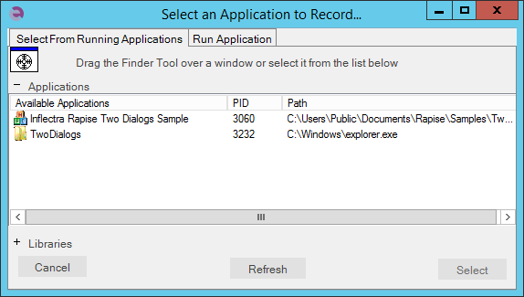
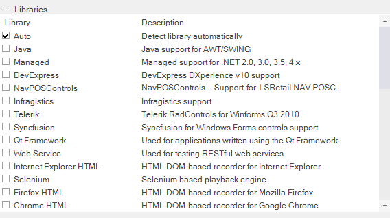

# Select an Application to Record... Dialog

## Purpose

The **Select an Application to Record**... dialog appears before [Recording](recording.md) when testing **desktop applications**.

It queries the user for which program to record, as well as what [Recording Library](recording_library.md) to use. If you are recording the same application for the second time then the dialog is not shown. The recording proceeds to last used application if it is still available on the screen.

## How To Open

To open the dialog, press the **Record** button on the toolbar.

## Available Applications

The **Available Applications** table lists all of the processes running at the time you open the **the dialog**.  If the process you would like to record is already open, you can select if from the table.

If you do not see the application to record in the list you may

1. Click **Refresh** button at the bottom of the dialog. It should help if you launched the application after opening the dialog.
2. Use **Finder Tool** to manually point to the application window. It should help if the window is not shown in the Windows taskbar.

## Libraries

The **Library** table lists the available Recording Libraries.  Select the one appropriate to the process/program you will record.  If you select **Auto**, Rapise will attempt to choose the correct recording library for you.  See the [Recording Library](recording_library.md) section for more information.

## Dialog Buttons

- The **Cancel** button closes the dialog.
- **Refresh** button: Press to refresh the **Available Applications** table.  After refreshing, you will see processes that began after the **dialog** was opened.
- **Select** button: To record a process from the **Available Applications** table, select the process and then press the `Select` button.

## Run Application Tab

- **Full path to application**: If the program you would like to record is not already open, you can specify its path here.  If the program is already running, you can select it from the **Available Applications** table.
- **Browse** button: Browse for an application to open and record.
- **Use working directory**: To set a specific working directory when launching the application, check the box and enter in a value for the **working directory**.
- **Run** button: To record a program that is not currently open, fill in the **Path** text-box and press the **Run** button.
- The **Cancel button** closes the dialog.
