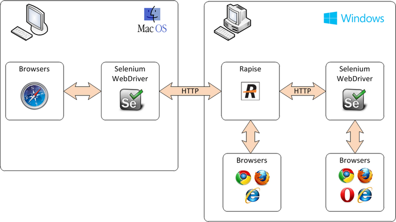
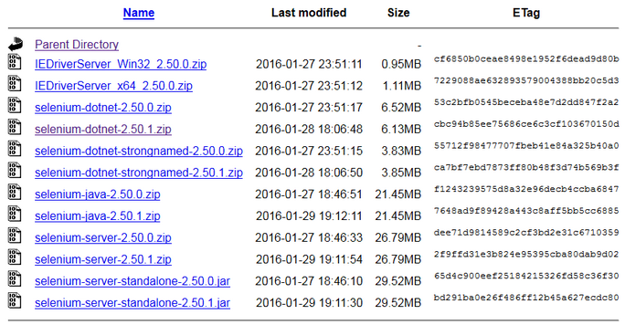
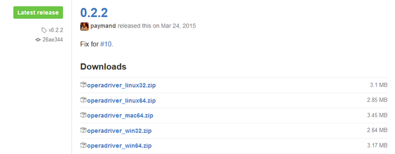

# Setting Up Selenium

This section describes the process for setting up Rapise to work with [Selenium](selenium_webdriver.md). Since Rapise is a Windows® application, you can use a single computer running Rapise to use the following web browsers:

- Internet Explorer
- Google Chrome
- Mozilla Firefox
- Opera
- Microsoft Edge

However because Safari only runs on Apple Mac computers, you will need to use two computers (a Mac running Safari) and a PC running Rapise to test using the Apple Safari web browser:

## Configuring Selenium on a PC

Once you have installed Rapise on your local computer, you need to perform the following steps to configure each of the web browsers to use Selenium and Rapise:

### Firefox

Unlike the other web browsers, Firefox does not require  anything special to be done, it already includes a built-in plugin for use by
Selenium WebDriver. However if you start using Rapise with Firefox and you see the following issue inside of Firefox:

Then it means that the version of Selenium WebDriver that shipped with Rapise is no longer compatible with the installed version for Firefox. The solution is straightforward, just go to the main Selenium website: [http://www.seleniumhq.org/download/](http://www.seleniumhq.org/download/) and then download the **C# WebDriver Bindings**:

Download the **Selenium-dotnet-x.x.x.zip** file from the website. Proceed to unzip the archive and then look in the **net40** subfolder
and extract the following two files and copy into the **C:\\Program Files (x86)\\Inflectra\\Rapise\\Bin** folder (or wherever you installed Rapise):

- WebDriver.dll
- WebDriver.Support.dll

*Note: You will need to close Rapise before copying these files into the Bin folder.*

### Microsoft Edge

To use Selenium with Microsoft Edge, you will need to download the latest version of the Edge Driver from the Microsoft website:

<https://developer.microsoft.com/en-us/microsoft-edge/tools/webdriver/#downloads>

Create a new folder on your local PC called:

**C:\\Program Files (x86)\\Microsoft Web Driver**

Download the **MicrosoftWebDriver.exe** to this local folder you just created:

### Internet Explorer

To use Selenium with Internet Explorer, you will need to download the latest version of the Internet Explorer IE Driver:

<http://selenium-release.storage.googleapis.com/index.html>

The list of versions at time of writing was:

When you click on the folder for the latest version you will see the various files that can be downloaded:

Download the **IEDriverServer\_XXXX\_X.X.X.zip** to your local PC:

- IEDriverServer\_Win32\_X.X.X.zip (for 32-bit Internet Explorer)
- IEDriverServer\_x64\_X.X.X.zip (for 64-bit Internet Explorer)

The file inside the zip archive is called **IEDriverServer.exe** and you need to copy it into the **C:\\Program Files
(x86)\\Inflectra\\Rapise\\Bin** folder (or wherever you installed Rapise).

### Chrome

To use Selenium with Google Chrome, you will need to download the latest version of the Chrome Driver:

<http://chromedriver.storage.googleapis.com/index.html>

The list of versions at time of writing was:

When you click on the folder for the latest version you will see the various files that can be downloaded:

Download the **chromedriver\_win32.zip** to your local PC.

The file inside the zip archive is called **chromedriver.exe** and you need to copy it into the **C:\\Program Files
(x86)\\Inflectra\\Rapise\\Bin** folder (or wherever you installed Rapise).

### Opera

To use Selenium with Opera, you will need to download the latest version of the Opera Driver:

<https://github.com/operasoftware/operachromiumdriver/releases>

This page will list the latest version of the driver at the top of the page:

Download the **operadriver\_winXX.zip** to your local PC:

- operadriver\_win32.zip (for 32-bit Opera)
- operadriver\_win64.zip (for 64-bit Opera)

The file inside the zip archive is called **operadriver.exe** and you need to copy it into the **C:\\Program Files
(x86)\\Inflectra\\Rapise\\Bin** folder (or wherever you installed Rapise).

## Installing Selenium on a Mac

The reason for using Selenium running on a Mac is to be able to execute tests against the Safari web browser. So although you can also use the Mac to test with Firefox, Opera and Chrome, we do not recommend this as it adds needless complexity.

### Safari

The first thing you need to do is download the latest version of the Selenium server for Apple Mac computers:

<http://selenium-release.storage.googleapis.com/index.html>

The list of versions at time of writing was:

When you click on the folder for the latest version you will see the various files that can be downloaded:

Download the **selenium-server-standalone-X.XX.X.jar** to the Mac.

Run this Java application by double clicking the downloaded .JAR file in Finder. This will startup the Selenium server.

*Note: You will need to have the Java (ideally the latest version) installed on the Mac first.*

You are now ready to test web applications running on Safari. The final step is to tell Rapise where it can find that instance of Selenium. To do that, open up Rapise (on your PC) and click on `Settings > Selenium` and then choose **Safari** profile:

Now you need to change the **Uri** field to point to your Mac. The format of the URI will be:

- http://&lt;IP or DNS name of MAC computer&gt;:4444/wd/hub

(for example it could be `http://test-mac01.local:4444/wd/hub` or `http://192.168.0.52:4444/wd/hub`)

### See Also
- [Testing with WebDriver in Safari](https://developer.apple.com/documentation/webkit/testing_with_webdriver_in_safari)