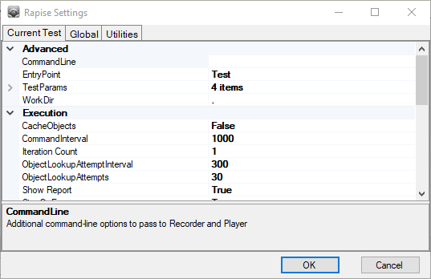

# Test Settings View

## Purpose

Use the Settings Dialog to change Test-specific settings.

## How to Open

Use `Test > Test Settings` [menu](menu_and_toolbars.md#Test) item to open settings in the expandable dialog window.

Another way is to choose root node in the [file view](test_files_dialog.md) to see test settings in the [property](properties.md) view.

## Advanced

* **CommandLine** is a freeform text box.  Use it to specify values for global variables (beginning in **g_**) to pass the [recorder](recording.md) and [player](playback.md).  You can view which global variables are available in the source files (such as **Player.js,** **SeSCommon.js**, etc).

* **EntryPoint** JavaScript function name (`g_entryPointName` variable) used as a test entry point. Normally `Test`, however it may be changed to execute a single scenario, i.e.: `MyScenario`.

* **WorkDir** Defines test root directory (`%WORKDIR%` environment variable) relative to this test's folder. 
  
    Usually it is equal to `.` (root test). In the sub-test it is `../.`, in sub-sub-test it is `../../.`. This way if you have common scenario used across tests and it refers to a data file using `%WORKDIR%\Data.xlsx` then all sub-tests will be able to find it. This feature together with a concept of [sub-tests](tests_and_sub_tests.md) help to build test [frameworks](https://www.inflectra.com/support/knowledgebase/kb371.aspx).

* **CommandLine** is a freeform text box.  Use it to specify values for global variables (beginning in **g_**) to pass the [recorder](recording.md) and [player](playback.md).  You can view which global variables are available in the source files (such as **Player.js,** **SeSCommon.js**, etc).

## TestParams

The TestParams section includes various custom test parameters:

Click to open the [TestParams Collection Editor Dialog](namevalue_collection_editor_di.md).

There is a build-in set of test parameters for [cross-browser testing](cross_browser_testing.md). When you open up a test that uses one of the HTML libraries it will display the following built-in test parameter that you can use to change the **playback browser**:

## Execution

* **CacheObjects**: Remember object locations and try to reuse them for speed.  This is helpful with dialog based applications.
* **CommandInterval**: Time interval (in milliseconds) between script commands during script execution.
* **IterationsCount**: Your test script will be executed this many times consecutively during [Playback](playback.md).
* **ObjectLookupAttemptInterval**: This is the time Rapise will wait between attempts to locate an object.
* **ObjectLookupAttempts**: This is the number of times Rapise will attempt to locate an object.
* **Show Report**: Display report after execution. Default is **True**.
* **StopOnError**: Terminate script execution after the first error. So failing test cases fail quickier. Default is **True**.

## Recording

* **BeautifySavedObjects** affects how the [Script Recorder](recording.md) writes object information to your test script.  If **False**, the object definition will be written as a single line, if **True**, the object definition will be written in a manner that takes more space, but is easier to read and change.
  
    Objects that were learned in previous recordings are affected by the value of **BeautifySavedObjects**.

## Screen Capture

* **Capture Cursor**: Set this to **True** if you want to include cursor position marker on the captured screenshot.
* **Capture Execution**: Set this to **True** if you want to save screen images for each recognized object during playback.
* **Capture Recording**: Set this to **True** if you want to save screen images for each action during recording.
* **Include in Report**: Set this to **True** to include the saved images in the execution report during playback.
* **Widget Only**: Set this to **True** to only save the widget area in the screenshot, as opposed to the whole window.

## Settings

* **UserFunctionsPath**: Path (relative to the test directory) to the file with user-defined functions utilized in this test.  Normally this file has name in form `User.js`.
* **ObjectsPath**: Path (relative to the test directory) to file containing object tree information. This file contains `saved_script_objects` structure with all object locators gathered during recording and learning. Normally this file has name in form `Objects.js`.
* **ReportPath**: Path (relative to the test directory) to the test's report file. Normally this file has extension form `.trp` which stands for **T**est **R**eport.
* **ScriptPath**: Path (relative to the test directory) to the test script.
* **TestPath**: Path to the test definition file (`*.sstest`).
