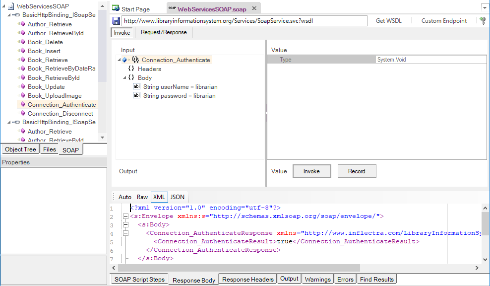
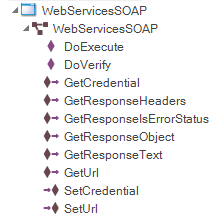
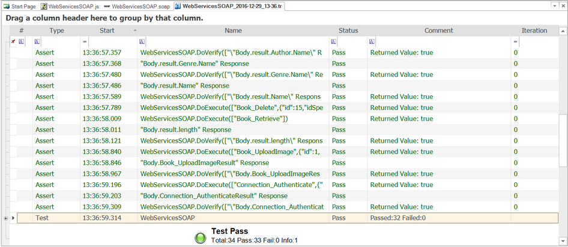

# Testing SOAP Web Services

## What is SOAP and what is a SOAP web service?
> SOAP is the **S**imple **O**bject **A**ccess **P**rotocol, and allows you to make API calls over HTTP/HTTPS using specially formatted XML. SOAP web services make use of the Web Service Definition Language (WDSL) and communicate using HTTP POST requests. They are essentially a serialization of RPC object calls into XML that can then be passed to the web service. The XML passed to the SOAP web services needs to match the format specified in the WSDL.

> SOAP web services are fully self-descriptive, so most clients do not directly work with the SOAP XML language, but instead use a client-side proxy generator that creates client object representations of the web service (e.g. Java, .NET objects). The web service consumers interact with these language-specific representations of the SOAP web service. However when these SOAP calls fail you need a way of testing them that includes being able to inspect the raw SOAP XML that is actually being sent.

## How does Rapise test SOAP web services?
Creating a SOAP web service test in Rapise consists of the following steps:

1.   Using the [SOAP test studio](soap_definition_editor.md) to create the various SOAP web service test actions and verify that they return the expected data in the expected format.

2.   Saving each of these SOAP API functions as Rapise learned objects.

3.   Generating the [test script](scripting.md) in Javascript that uses the learned Rapise web service objects.

## Rapise SOAP Testing Studio
When you add a SOAP web service to your Rapise test project, you get a new SOAP definition file (`.soap`) that will store all of the test invocations against a specific SOAP web service:



The SOAP test studio (illustrated above) works by connecting to the WSDL location that you specify in the **Endpoint** part of the [Toolbar](toolbar_soap.md):


When you enter in the URL to your SOAP Web Service WSDL file and click `Get WSDL`, Rapise will download the WSDL file and display the list of available methods in the SOAP explorer:


Clicking on one of the available methods (e.g. **"Connection_Authenticate"**) will display that method in the main SOAP editor. Normally you will start using the **Invoke** tab of the SOAP editor:


This is where you can tell Rapise to invoke the method, pass any expected parameters and view the response from the service.

If the SOAP method expects input parameters, they will be displayed in the "Body" section of the Input in a treeview. You can expand the tree and fill in the various values. In the example above, we have passed the login and password as parameters.


When you click the `Invoke` button, Rapise will send the SOAP request to the API and display the returned output in the Output section. In this case we get the value "True" back, indicating that our authentication request was successful.


You can also click on the **Request/Response** tab to view the raw SOAP XML that was sent to and from the server. This is very useful when debugging a service that does not work as expected.


## Web Service Object Recognition

Unlike the REST web service testing editor, each SOAP endpoint will generate a single Rapise SOAP object in the object tree:


The object WebServicesSOAP maps to a corresponding `.soap` file in the Rapise project. Such an object can be used for all of the web service requests in that file:

```javascript
var WebServicesSOAP=SeS('WebServicesSOAP');
WebServicesSOAP.DoExecute('Connection_Authenticate', { "userName": "librarian", "password": "librarian"}, {} );
WebServicesSOAP.DoExecute('Book_Retrieve');
WebServicesSOAP.DoVerify('"Body.result.length" Response', "Body.result.length", 14);
WebServicesSOAP.DoExecute('Book_Insert', { "book": {   "Author": {"Name": ""}, "AuthorId": 2, "AuthorIdSpecified": true, "DateAddedIso": "2016-10-02T20:00:00", "Genre": {"Name": "" }, "GenreId": 3, "GenreIdSpecified": true,   "Id": 0,   "IdSpecified": false,   "IsOutOfPrint": false,   "IsOutOfPrintSpecified": false,   "Name": "A Christmas Carol" }} );
Log("Resp: "+WebServicesSOAP.RequestProperties.requestPayLoad);
```


In the example above, the same object "WebServicesSOAP" is being used with `DoExecute` with different SOAP methods passed as the first parameter (**"Connection_Authenticate"**, **"Book_Retrieve"**, **"Book_Insert"**).

## Generating Rapise SOAP Test Scripts

To save time, Rapise can generate the test scripts code automatically for you (instead of having to write it by hand). To do that, after you have verified that a particular method works as expected, when you click the **Invoke** command, then click the `Record` button to record the step, and if you want to verify the data returned, also click on the `Verify` button. That will generate the following:


The steps recorded will be in **bold** type if they include a verification step, and will be in normal type if they are simply invoked with no verification. When you click the `Create Script` button, the following will be generated:

```javascript
WebServicesSOAP.DoExecute('Connection_Authenticate', {"userName":"librarian","password":"librarian"});
Tester.Assert('Connection_Authenticate Response', WebServicesSOAP.GetResponseObject(), {"Body":{"Connection_AuthenticateResult":true,"Connection_AuthenticateResultSpecified":true},"Headers":{}});
WebServicesSOAP.DoExecute('Book\_Retrieve', {});
Tester.Assert('Book_Retrieve Response', WebServicesSOAP.GetResponseObject(), { ... });
WebServicesSOAP.DoExecute('Connection_Disconnect', {});
```

## Playback of SOAP Tests

Once you have created your SOAP web service tests, you can use the standard [Playback](playback.md) functionality in Rapise to execute your test and display the report:


