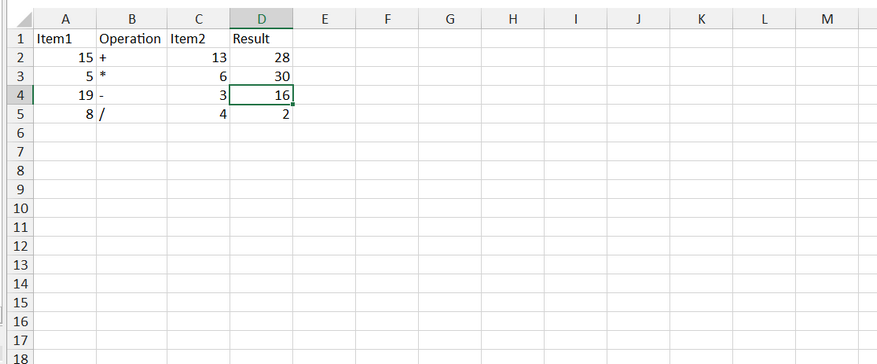

# Spreadsheet Editor

## Purpose

The Spreadsheet editor lets you view and edit Microsoft Excel spreadsheet files (.xls or .xlsx). This very convenient when you are doing [data-driven testing](data_driven_testing.md) and need to create or edit the test data directly inside Rapise.

## How to Open

Use the [Test Files View](test_files_dialog.md) to open an Excel file.  The Excel file will be opened in a **Spreadsheet Viewer,** in the [Content View](content_view.md).  The [Spreadsheet](toolbar_spreadsheet.md) tab of the Ribbon will also open.

## Formula Bar

The formula bar lets you see/edit the contents of the currently selected cell as well as enter more complex Excel calculations/formulas:

## Spreadsheet Grid

The main spreadsheet grid lets you see the cells in the spreadsheet, select a range and use the [Spreadsheet ribbon](toolbar_spreadsheet.md) to change the format:

## Cell Formatting

By default all cells have General format. It means that format of a cell value is determined automatically during read operation. It may lead to undesired effects. For example, if a cell contains date `5/1/2020`, the value read will be `43952`. If you want to get cell value in text format you may change the format to Text using **Format Cells** dialog.

Then you need to re-enter the date. After that Rapise will read the date exactly as `5/1/2020`.
