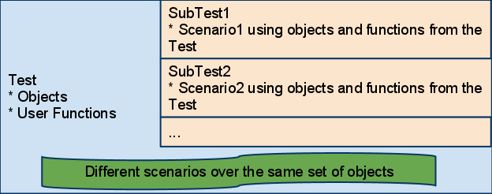
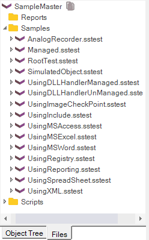
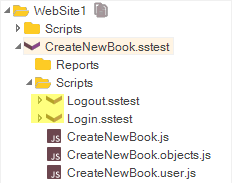
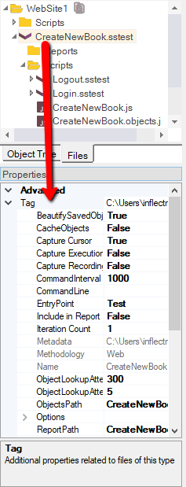

# Tests and Sub-Tests

The concept of Sub-Test is an organic way to organize the whole work with Tests in organic way. By having sub-tests one may meet one of the following goals:

1. Create multiple test scenarios working with same set of Objects and Functions.

2. Organize different test scenarios into a single workspace.

3. Use Sub-test to make cross-browser tests.

We will consider each of described goals separately. The test containing the sub-test(s) we will call **base** or **parent** test.

## Make Multiple Test Scenarios with the Same Set of Objects

In this case **parent** test contains all learned objects and user-defined functions.



For example, the parent test may have objects "User Name", "Password", "Sign On". And function

```javascript
function Login(username, password)
{
   ...
}
```

SubTest1 may be used to check login with valid Credentials, `Main.js` from **SubTest1** looks like:

```javascript
function Test()
{

   Login("validuser", "validpassword");

   // Now check that login is successfull

   Tester.Assert("Login leads to welcome message: ", Global.DoWaitFor('Welcome_User'));

}
```

SubTest2 may be used to check login with invalid Credentials (i.e. it is a fail-test). `Main.js` from **SubTest2** looks like:

```javascript
function Test()
{

   Login("invaliduser", "invvalidpassword");

   // Now check that login is successfull

   Tester.Assert("Login leads to invalid user object: ", Global.DoWaitFor('Invalid_User'));

}
```

Function Login and objects Welcome_User and Invalid_User are defined in Test. The subtests are just implementing various scenarios for the same set of objects.

## Organize different tests into a single workspace.

Each test has its own objects, functions and scenarios.


The usage of such an approach is well demonstrated by example. We created a test called **SampleMaster** and put all Rapise samples into it by using **Add File** context menu in the the [Test Tree](test_files_dialog) dialog. Finally the Files tree looks like:



All tests in this tree are independent. We use the Sample Master to manage all the tests from a single environment.

## Sub-Test Features

*   Sub-test may have its own nested sub-tests. For example, in the parent test contains reference to 'CreateNewBook' subtest having 'Login' and 'Logout' subtests inside:

    

*   Sub-test properties are available from the 'Tag' property in the 'Properties window:

    

*   The following options are available in the context menu fore each of the sub-tests:

    

*   `Play`: Execute selected sub-test
*   `Record`: Start recording into selected sub-test
*   `Save`: Save options of a sub-test
*   `Show Objects`: Show objects form a sub-test in the Object Tree
*   `Delete`: Remove reference to a sub-test from its parent test  


## %WORKDIR% and Frameworks

Test and sub-tests is a recommended way to set up test frameworks with Rapise. `%WORKDIR%` is set to the root test path and it is recommended to use it to refer to other tests or data files. 

See sample framework <https://github.com/Inflectra/rapise-framework-examples/tree/master/SpiraFriendlyWithRvlAndUserLib>