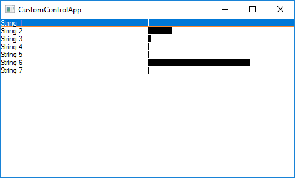
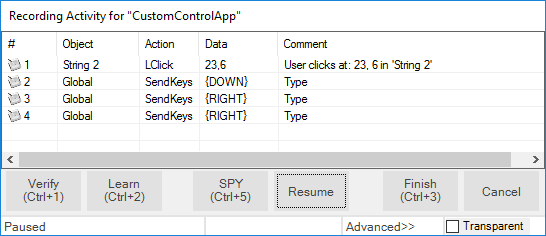
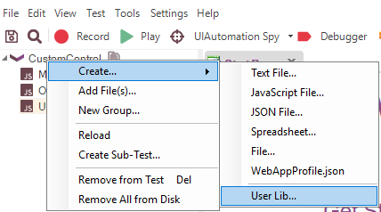
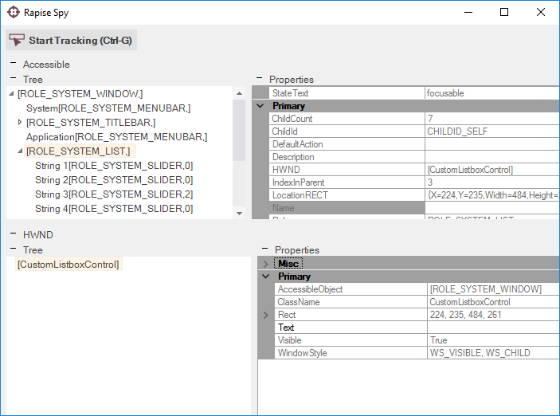
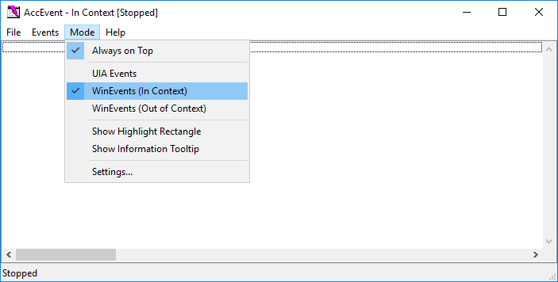
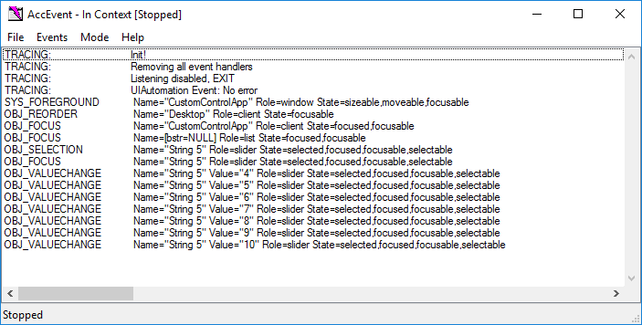
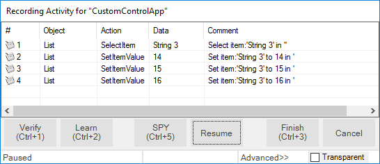

# Tutorial: Custom Library

In this section, you will learn how to create a **Custom Library** and add support for a third-party GUI control to Rapise.  We will be using a demo application called **CustomControlApp**. Our Custom Library  will be simple.  It will allow to  Record and Learn objects of **CustomListboxControl** type and also playback actions for this type of objects. This tutorial is complemented by a ready test **CustomControlTest** which you'll be able to examine and run.

## Tutorial Data

**CustomControlApp Folder**

```nohighlight
C:\Users\Public\Documents\Rapise\Samples\Extensibility\CustomLibrary\CustomControlApp
```

You may build this application yourself in Microsoft Visual Studio (C++) or use ready executable:

```nohighlight
<CustomControlApp folder>\Release\CustomControlApp.exe
```

**CustomControlTest Folder**

```nohighlight
C:\Users\Public\Documents\Rapise\Samples\Extensibility\CustomLibrary\CustomControlTest
```

**Custom Library File**

```nohighlight
C:\Users\Public\Documents\Rapise\Samples\Extensibility\CustomLibrary\CustomControlTest\Lib\LibUser\LibUser.js
```

If you prefer active experimentation learning style you may first skip to subsection 8 and after playing with the ready test and library start reading from the beginning.

## 1. Application Under Test

CustomControlApp contains an object of type **CustomListboxControl**. The control is similar to a single-select listbox, but each line item has a corresponding **progress bar** indicator indicating a current value. Using the left/right cursor keys you can change the value of the currently focused item.



If you will try to record a test for **CustomControlApp** using just **Generic** library you'll see that **CustomListboxControl** is treated as **Simulated Object** and all interactions with it are recorded as mouse clicks and key presses. For some tests such functionality is sufficient, but if you want to be able to recognize **CustomListboxControl** as a list, get its items, select an item by name, set value for a particular item you need to create a **Custom Library**.



## 2. LibUser

In `Files` view right click the test node and choose `Create > User Lib...`



Specify name of your library (`User`) and click `OK` button.


LibUser library consists of two files:

1. **LibUser.jslib** which is a library declaration file.
2. **LibUser.js** which is a library definition file.


Double-click `LibUser.js` file to open it in the editor.

## 3. Analyze CustomListboxControl in Spy

Launch **CustomControlApp** and open [Spy](ses_spy_dialog.md). Using the **Accessible** option in the Spy tool, spy on the **CustomListboxControl**. It is easy to see that **CustomListboxControl** has the following accessibility tree: `ROLE_SYSTEM_WINDOW` top node contains `ROLE_SYSTEM_LIST` child that in its turn may contain zero to many `ROLE_SYSTEM_SLIDER` nodes.



## 4. Create Matcher Rule for CustomListboxControl

With knowledge of **CustomListboxControl** accessibility tree we can create a **matcher rule** that will make **CustomListboxControl** recognizable by Rapise. Write the following code into `LibUser.js`:

```javascript
/**
    ROLE_SYSTEM_WINDOW
        ROLE_SYSTEM_LIST (CustomListboxControl)
        ROLE_SYSTEM_SLIDER*
*/
new SeSMatcherRule(
{
    object_type: "CustomListboxControl",
    object_flavor: "List",
    behavior: [Win32ItemSelectable, Win32CustomListboxControl],
    role: "ROLE_SYSTEM_WINDOW",
    or_rules: [
        {
            role: "regex:ROLE_SYSTEM_LIST",
            save_to: "list",
            or_rules: [
                {
                    role: "ROLE_SYSTEM_SLIDER",
                    zero_to_many: true,
                    save_to: "items"
                }
            ]
        }
    ]
});
```

Each matcher rule (instance of `SeSMatcherRule`) is a tree like structure that describes a particular GUI control type. Each node in this tree is a rule object that is defined by the following simplified grammar:

```nohighlight
or_rules: (rule)+
and_rules: (rule)+

rule:
    role
    [save_to]
    [zero_to_many]
    [or_rules]
    [and_rules]
```

- **object_type** - the string that uniquely identifies this matcher rule and designates type of the control.
- **object_flavor** - visual type of the control, it is used to show an appropriate icon in the [Object Tree](object_tree.md) and to filter actions and properties in composite behavior patterns.
- **behavior** - array of behavior patterns that define object actions, properties and events.
- **role** - accessibility role of the corresponding node in the accessibility tree of the control. The role equals to a Role of the accessible element as displayed in the Spy.
- **or_rules** - array of rules (defining child nodes) joined with logical OR. Any OR rule can be satisfied to consider child nodes matched.
- **and_rules** - array of rules (defining child nodes) joined with logical AND. All AND rules must be satisfied to consider child nodes matched.
- **save_to** - `SeSObject` created for accessibility tree node corresponding to this rule is assigned to the field with `save_to` name of the top level `SeSObject`. I.e. if rule has save_to: `items` element then you can access learned element using `SeS('ObjID').items`. In many cases such named fields are used in behavior patterns.
- **zero\_to\_many** - if this property is present in the rule and set to 'true' then it means that parent rule may contain from zero to many of child nodes that match this rule.

## 5. CustomListboxControl Behavior

After defining the matcher rule we can proceed to **behavior patterns**. Behavior patterns operate with `SeSObject` contents, so they should not be aware about accessibility tree of the underlying GUI control and thus the same behavior pattern can be assigned to different matcher rules. There are a plenty of behavior patterns defined in

```nohighlight
C:\Program Files (x86)\Inflectra\Rapise\Engine\SeSBehavior.js
```

After looking at those patterns it is possible to notice that `Win32ItemSelectable` pattern is the one that perfectly suites for capturing selection accessibility events and for selecting list items. This pattern contains `OnSelect` event that is called during recording when an item is selected in list and `DoSelectItem` action used to select desired item during playback.

But using just `Win32ItemSelectable` behavior pattern is not sufficient. It does not support recording of progress bar value change events and it does not support setting progress bar value during playback. That is why we need to define new behavior pattern: `Win32CustomListboxControl`. Look at its code:

```javascript
var Win32CustomListboxControl =
{
    actions: [
        {
            actionName: "SetItemValue",
            DoAction: function(/**string*/ itemName, /**number*/ value)
            {
                var item = this.findItemByName(itemName);
                if(null!=item)
                {
                    item.getTopObject().instance.HWND.SetForegroundWindow();
                    item.instance.Value = value;
                    return true;
                }
                return false;
            }
        },
        {
            actionName: "GetItemValue",
            DoAction: function(/**string*/ itemName)
            {
                var item = this.findItemByName(itemName);
                if(null!=item)
                {
                    return parseInt(item.instance.Value);
                }
                return null;
            }
        }
    ],
    events:
    {
        OnValueChange: function(/**SeSObject*/ param)
        {
            var itemName = param.name;
            if(l2)Log2("OnValueChange:"+itemName);
            var item = this.findItemByName(itemName);
            if(null!=item)
            {
                var value = item.instance.Value;
                RegisterAction(this, param.name, "SetItemValue", parseInt(value),
                    "Set item:'"+param.name+"' to "+value+" in '"+this.name+"'");
            }
            return;
        }
    }
};
```

During recording process `OnValueChange` function captures progress bar change events and calls `RegisterAction` function that adds `SetItemValue` action to the test.

Put this code into `LibUser.js` **before** the rule created in the previous step.

## 6. CustomListboxControl Specific Accessibility Events

What accessibility events are fired when a user changes the progress bar value? You can use [Accessible Event Watcher](https://docs.microsoft.com/en-us/windows/desktop/winauto/accessible-event-watcher) to find out. Launch **CustomControlApp** and start **Accessible Event Watcher**. Make sure that mode is set to `WinEvents (In Context)`



Select an item in **CustomControlApp** and advance its progress bar using right key. **Accessible Event Watcher** will show you captured events:



You can see that changing progress bar leads to generation of `OBJ_VALUECHANGE` events. To get event name to use with Rapise open [Event Constants](https://docs.microsoft.com/en-us/windows/desktop/winauto/event-constants) page and search for relevant value.


Not all accessibility events are processed and propagated by Rapise engine. `EVENT_OBJECT_VALUECHANGE` is one of such events. To consume this event and make an appropriate call to `OnValueChange` of `Win32CustomListboxControl` you need to add and register **custom accessibility event handler**:

```javascript
/**
 * Custom handler for EVENT_OBJECT_VALUECHANGE event
 */
function CustomRegisterAccessibleEvent(evt, etxt)
{
    if(etxt.indexOf("EVENT_OBJECT_VALUECHANGE")>=0)
    {
        var ao;
        try
        {
            ao = evt.AccessibleObject;
            if(!_SeSIsValidObject(ao)) return false;
        }
        catch(e)
        {
            Log("Error getting event object:"+e.Description+"/"+etxt);
            return false;
        }

        var ro = SeSCacheAccessibleObject(ao);
        if (l3 && ro) Log3("CustomListboxControl: " + ro.toString());

        if (ro != null && ("OnValueChange" in ro))
        {
            ro.OnValueChange();
        }

        return true;
    }
    return false;
}

g_customEventHandlers.push(CustomRegisterAccessibleEvent);
```

## 7. Record and Playback

Update `LibUser.jslib` library definition for automatic loading.


Now you are ready to record and playback a test. Just remember that in **Select an Application to Record** dialog you need to uncheck **Auto** library and select **Generic** library.


Notice **Action** names in **Recording Activity** dialog, they correspond to `Win32ItemSelectable` and `Win32CustomListboxControl` behaviors.



## 8. CustomControlTest

This tutorial is complemented by a ready test **CustomControlTest** which you can examine and run. Open **CustomControlTest** in Rapise from

```nohighlight
C:\Users\Public\Documents\Rapise\Samples\Extensibility\CustomLibrary\CustomControlTest
```


**Tip**: It is possible to launch CustomControlApp right from Rapise, just double click on CustomControlApp.exe in the file tree.

## 9. Wrap-up: Implementation Sequence

Full support for a custom object requires support for Recording, Learn and Playback. Let's go over created library and specify the purpose of each component in it.

- **Matcher Rule** - it is used to recognize the object inside an application, required for Recording, Learn and Playback.
- **Events in Behavior Patterns** - handling events is required for Recording.
- **Actions in Behavior Patterns** - actions are used to examine or change state of the control, required for Playback.
- **Custom Accessibility Event Handler** - required for Recording if some important events are not processed by Rapise engine by default.
