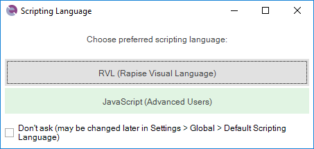
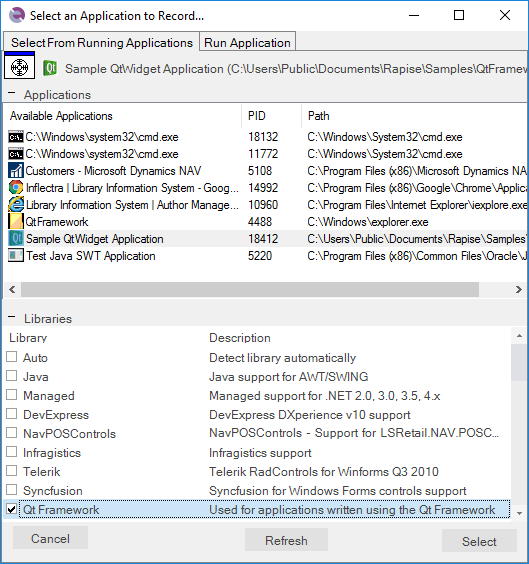
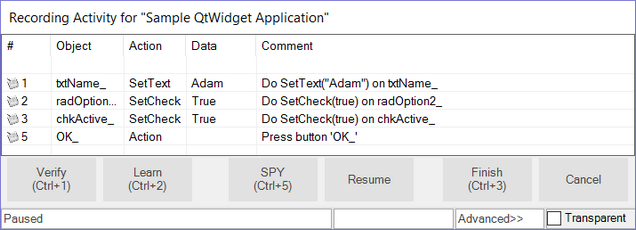
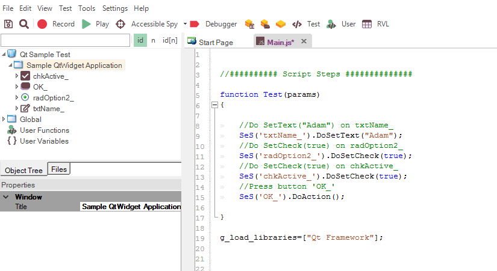
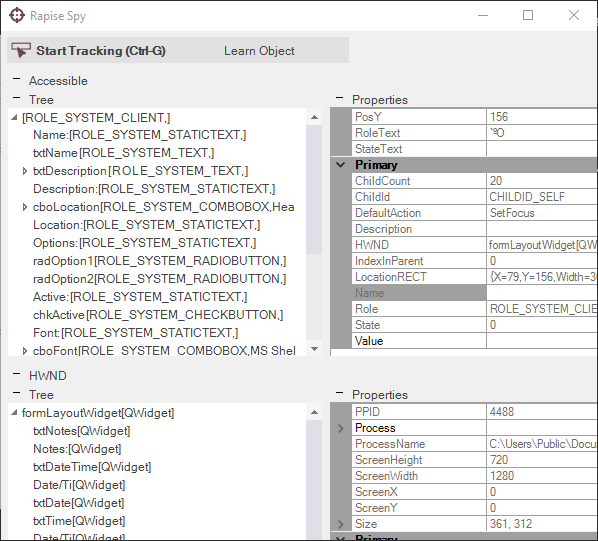

# Using JavaScript

Rapise includes support for testing applications written using the Qt Framework and QWidget controls.

To ensure that Rapise can access the UI elements and properties in the Qt application being tested, [MSAA (Microsoft Active Accessibility) support for your Qt application must be enabled](qt_framework_testing.md). This provides additional information on Qt UI elements to automation software like Rapise and can be accomplished by shipping and loading the "Accessible Plug-in" included in the Qt SDK (Software Development Kit) with the Qt application under test (see below).

This tutorial illustrates the ability of Rapise to test such Qt applications using a sample application that already has the MSAA support added.

This version of the tutorial uses the JavaScript test editor option in Rapise. If you'd prefer to use the [Rapise Visual Language (RVL)](visual_language.md), please go to the main [Tutorial](tutorial_qt_framework.md) instead.

## Testing the Sample Qt Application

On the [Start Page](start_page.md) of Rapise, click on the **Fetch Samples** button to make sure you have all of the latest samples available.

Then go to
    
    C:\Users\Public\Documents\Rapise\Samples\QtFramework
    
and double-click on the `QtWidgetApp.exe` file to start the sample application.

If you have everything configured correctly, you will see:

Once the application is started, open up Rapise and click menu `FIle > New Test`:

Enter the name **Qt Sample Test** as the name and choose **Basic: Windows Desktop Application** as the methodology.
Then choose JavaScript as the scripting choice:

Once the test is created, you will see:

Click on the **Record** button to display the ["Select an Application to Record"](select_an_application_to_record_dialog.md) dialog:

Choose the **Sample QtWidget Application** from the list of running applications, change the library selection from Auto to **Qt Framework** and click `Select`.

Now in the sample application click on some of the Qt controls. Rapise will record the actions:

When you click **Finish**, you will see the recorded test script and learned objects:

You can drag and drop any of the learned objects from the left-hand pane into the main test script. You can also just type **SeS("OK_")** (for example) and Rapise will display the list of available functions.

When you click **Play**, Rapise will play back your test script against the application:

Sometimes you need to learn objects that are not visible or are obscured by other objects. To help with this, Rapise has the Object Spy tool.

The Spy tool lets you see the objects in the application in a hierarchy that you can learn.

When you are in the middle of recording, click on the **Spy** button and Rapise will display the [Accessible Spy](object_spy_accessible.md):

You can then use the [Accessible Spy](object_spy_accessible.md) to track and find objects in the application hierarchy. You can navigate to parent objects by right-clicking on them and choosing **Parent**. Once you have found the desired object, click on the **Learn Object** in the Spy toolbar and Rapise will add the object in the Spy to the list of learned objects that you can test against.

## See Also

- [Testing Qt Framework Applications](qt_framework_testing.md)
