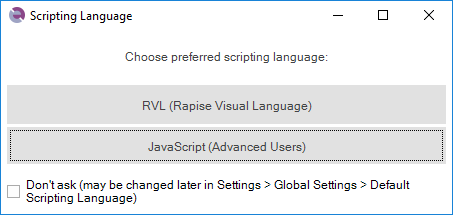
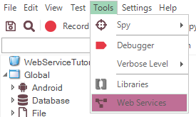
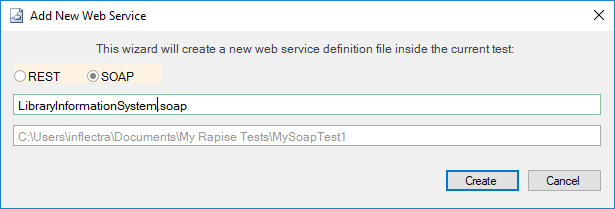
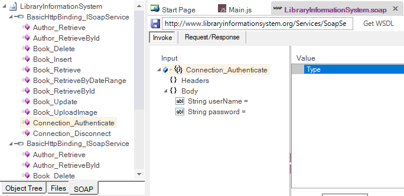
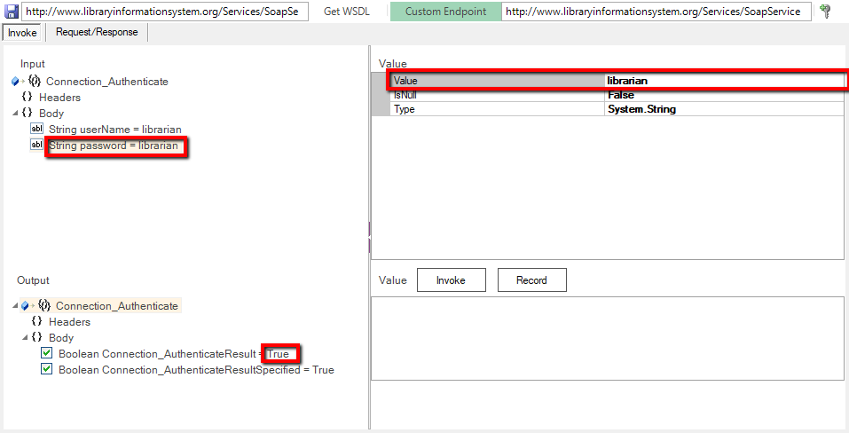
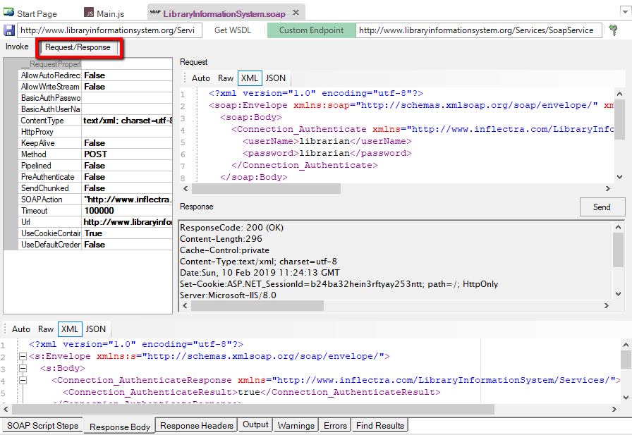
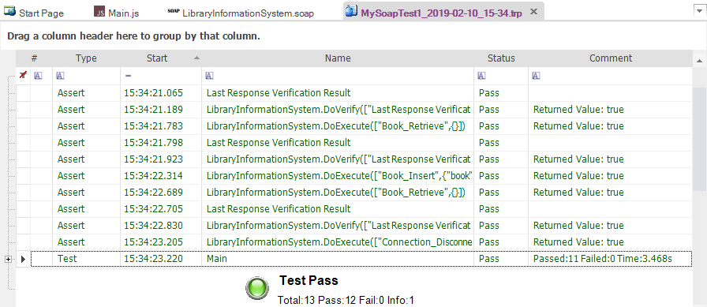

# Tutorial: SOAP Web Services

In this section you shall learn how to test a SOAP web services API using Rapise. We shall be using a demo application called **Library Information System** that has a dummy SOAP web service API available for learning purposes. You can access this sample application at <http://www.libraryinformationsystem.org>, and its SOAP web service API can be found at:

<http://www.libraryinformationsystem.org/Services/SoapService.aspx>

## What is SOAP and what is a SOAP web service?
<!-- /* cSpell:disable */ -->
> SOAP is the **S**imple **O**bject **A**ccess **P**rotocol, and allows you to make API calls over HTTP/HTTPS using specially formatted XML. SOAP web servicesmake use of the Web Service Definition Language (WDSL) and communicate using HTTP POST requests. They are essentially a serialization of RPC object calls into XML that can then be passed to the web service. The XML passed to the SOAP web services needs to match the format specified in the WSDL.
<!-- /* cSpell:enable */ -->
> SOAP web services are fully self-descripting, so most clients do not directly work with the SOAP XML language, but instead use a client-side proxy generator that creates client object representations of the web service (e.g. Java, .NET objects). The web service consumers interact with these language-specific representations of the SOAP web service. However when these SOAP calls fail you need a way of testing them that includes being able to inspect the raw SOAP XML that is actually being sent.

## Overview

Creating a SOAP web service test in Rapise consists of the following
steps:

1. Using the SOAP web services studio to inspect the SOAP WSDL

2. Invoke the various SOAP operations and verify that they return the expected data in the expected format.

3. Generating the test script in JavaScript that uses the learned Rapise web service objects based on the WSDL.

We shall discuss each of these steps in turn.

### 1. Inspecting the SOAP WSDL Endpoint

Create a new test in Rapise called `MySoapTest1.sstest`. For methodology, choose **Basic: Windows Desktop Application (Windows Native, .NET, Java, WPF etc)** and Rapise will create a new blank test project.


Language selection prompt is shown. For Web Services it is recommended to use `JavaScript`. 



Once you have created it, choose  `Tools > Web Services` menu to add a new web service definition to your test project:



This will display the Add New Web Service dialog box:



Choose **SOAP** as the type of web service you want to create.

Then, enter the name of the web service that you're going to add, in this case enter **"LibraryInformationSystem.soap"** and click `Create`.

This will add the SOAP web services definition file to your test
project:


In the **Endpoint** section of the [SOAP toolbar](toolbar_soap.md), enter the following URL to the sample application's WSDL file:

    http://www.libraryinformationsystem.org/Services/SoapService.svc?wsdl

then click the `Get WSDL` to load the list of SOAP operations:


Now click on the **Connection_Authenticate** operation in the SOAP
explorer:



This is the first operation we will need to invoke since it is used to authenticate with the online library system before calling the other functions.

You can click on each of the different SOAP operations (e.g. for inserting, retrieving, deleting or updating a book) and the SOAP studio will display the expected input and output parameters as well as any headers.

In the next section we shall be performing the following actions:


* Authenticating as a specific user

* Viewing the list of books

* Inserting a new book

* Viewing the updated list of books

* Disconnecting

Each one will involve calling a specific SOAP operation with some input parameters, viewing the data returned and adding a verification step if appropriate.


## 2. Invoking the SOAP Actions

Starting with the **Connection_Authenticate** operation that we had selected, click on the two Input parameters in turn and enter values:

* **userName** = librarian
* **password** = librarian

Then click the `Invoke` button underneath:



You can see that the response to our Invoked operation as a simple
boolean value of **True** returned. That indicated that we authenticated
correctly. If you try putting in an incorrect login/password, you'll get
back **False** instead.

If you have a SOAP web service that doesn't behave as expected, you may
want to view the raw SOAP XML that is being sent to/from the web
service. To view this, click on the **Request/Response** tab of the SOAP
studio editor and the following will be displayed:



This view lets you see the Request and Response HTTP headers body, with
the body displayed in a friendly, easy to read color-coded XML format.
That way you can easily invoke the SOAP operations using the Rapise SOAP
studio GUI and view the raw SOAP XML being sent to/from the server. This
is invaluable when debugging a failing SOAP web service.

In the case of our test of **Connection_Authenticate**, we can now
click the `Record` button (next to `Send`) to add this operation to our
list of recorded test steps:


Once you have added the operation to the list of recorded steps, you can
go one step further and ask Rapise to verify the data returned. To do
that, click on the `Verify` button that is displayed next to the
`Record` button. The step will now switch to **bold** to indicate that
a verification step is also included.


Now we need to repeat this process for the following additional
operations:

* **Book_Retrieve**

* * No Input Parameters

* * Press `Invoke` to test the retrieve

* * Press `Record` to record the test script

* * Click `Verify` to add a verification step

* **Book_Insert**

* * Populate the **Book** input object with these values:

* * AuthorId = 2

* * AuthorIdSpecified = True

* * GenreId = 3

* * GenreIdSpecified = True

* * Name = `A Christmas Carol`

* * DateAdded = (pick a date using the date picker)

* * DateAddedSpecified = True

* * DateAddedIso = 2017-01-04T07:46:36

* * Press `Invoke` to test the insert

* * Press `Record` to record the test script

    

* **Book_Retrieve**

* * No Input Parameters

* * Press `Invoke` to test the retrieve

* * Press `Record` to record the test script

* * Click `Verify` to add a verification step

* **Connection_Disconnect**

* * No Input Parameters

* * Press `Invoke` to test the retrieve

* * Press `Record` to record the test script

Once you have completed all these steps, you will see the following
recorded in the **SOAP Script Steps** box:


Now that we have recorded the operations and verifications, we can
proceed to generate the test script in Rapise that will regression test
the web service.

## 3. Generating the Rapise Test Script

In the SOAP Script Steps toolbar, click on the `Create Script` button to generate the initial test script:


Click on the `Test` shortcut in the main toolbar, and Rapise will display the `Main.js` file.

In the main Rapise test script file, you will see the following generated:


```javascript
function Test()
{
    var LibraryInformationSystem=SeS('LibraryInformationSystem');

    LibraryInformationSystem.DoExecute('Connection_Authenticate',{"userName":"librarian","password":"librarian"});

    Tester.Assert('Connection_Authenticate Response', LibraryInformationSystem.GetResponseObject(), {"Body":{"Connection_AuthenticateResult":true,"Connection_AuthenticateResultSpecified":true},"Headers":{}});

    LibraryInformationSystem.DoExecute('Book_Retrieve', {});

    Tester.Assert('Book_Retrieve Response', LibraryInformationSystem.GetResponseObject(), {...}\]},"Headers":{}});

    LibraryInformationSystem.DoExecute('Book_Insert', {"book":{"Author":{"Name":""},"DateAdded":"2017-01-04T07:46:36","DateAddedSpecified":true,"DateAddedIso":"2017-01-04T07:46:36","Genre":{"Name":""},"Name":"A Christmas Carol"}});

    LibraryInformationSystem.DoExecute('Book_Retrieve', {});

    Tester.Assert('Book_Retrieve Response',LibraryInformationSystem.GetResponseObject(), {...},"Headers":{}});

    LibraryInformationSystem.DoExecute('Connection_Disconnect', {});

}
```

You will see each of the SOAP functions called in turn, with
verification code automatically added.


We can add some comments to make it easier to read:

```javascript
    //Authenticate

    var LibraryInformationSystem=SeS('LibraryInformationSystem');

    LibraryInformationSystem.DoExecute('Connection_Authenticate',{"userName":"librarian","password":"librarian"});

    Tester.Assert('Connection_Authenticate Response',LibraryInformationSystem.GetResponseObject(), {"Body":{"Connection_AuthenticateResult":true,"Connection_AuthenticateResultSpecified":true},"Headers":{}});


    //Verify the initial list of books

    LibraryInformationSystem.DoExecute('Book_Retrieve', {});

    Tester.Assert('Book_Retrieve Response', LibraryInformationSystem.GetResponseObject(), {...}\]},"Headers":{}});

    LibraryInformationSystem.DoExecute('Book_Insert', {"book":{"Author":{"Name":""},"DateAdded":"2017-01-04T07:46:36","DateAddedSpecified":true,"DateAddedIso":"2017-01-04T07:46:36","Genre":{"Name":""},"Name":"A Christmas Carol"}});


    //Verify the updated list of books and disconnect

    LibraryInformationSystem.DoExecute('Book_Retrieve', {});

    Tester.Assert('Book_Retrieve Response',LibraryInformationSystem.GetResponseObject(), {...},"Headers":{}});

    LibraryInformationSystem.DoExecute('Connection_Disconnect', {});
```


When you click the `Play` button in the main toolbar, you will see
the following result:




Congratulations! You have recorded and executed a [SOAP web service
test](soap_web_services.md).
