# Microsoft Dynamics 365 Unified Service Desk

Unified Service Desk (USD) is a hybrid application. It is a windows desktop application with embedded browser components. Follow this guide to setup a test automation framework for USD.

## Hybrid Application

Most of the panels in USD are web views (highlighted in red) and some parts are pure desktop areas (highlighted in orange). Rapise is able to deal with web content in USD same way it deals with pure web applications loaded into browsers. Desktop parts of USD are controlled through **UIAutomation** library.


## Browser Profile

In order to deal with web content in USD a browser profile should be configured.  This profile will be used by Rapise to connect to embedded browser components.

1. In the main menu select `Settings > Browser`.
2. Select Internet Explorer HTML profile and click Duplicate.
3. Specify name for the new profile: UnifiedServiceDesk.
4. Set Browser Path to `C:\Program Files (x86)\Microsoft Dynamics CRM USD\USD\UnifiedServiceDesk.exe`
5. Set `Default Click Mode` to **click**.
6. Save the profile.

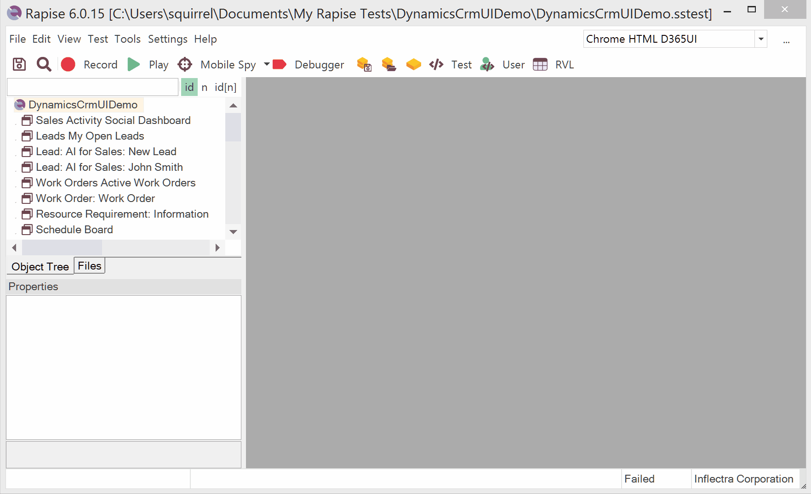

## Test Framework

### Root Test

Suggested approach to building a test framework for USD is to create a root empty test which will serve as a container for test scenarios and building blocks.

Let's create USDFramework test. Choose Web methodology, UnifiedServiceDesk browser profile and RVL options along the way.

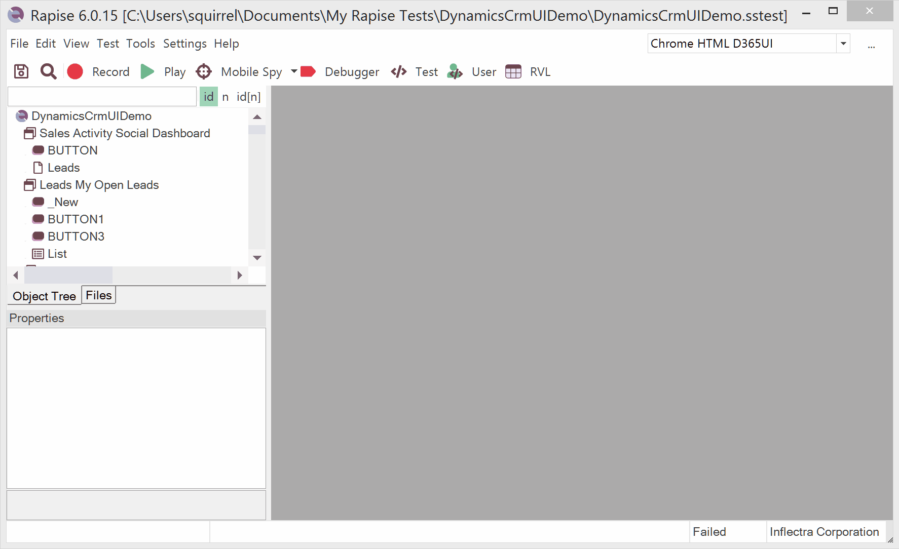

In the main file of the test (`Main.js`) specify the list of libraries to load:

```javascript
g_load_libraries=["UIAutomation", "%g_browserLibrary:UnifiedServiceDesk%", "DomDynamicsCrm"];
```


## Browser Automation Sub-Test

For recording web content related actions create a sub-test inside USDFramework. Let's name it USDDashboard. Choose Web methodology and UnifiedServiceDesk browser profile along the way.

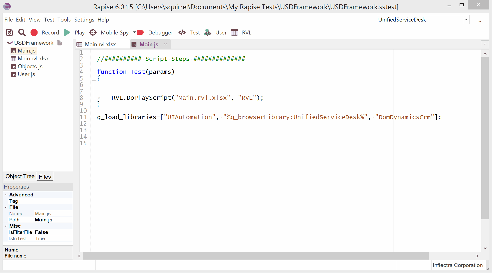

Double click USDDashboard test to open it in another instance of Rapise. Append `DomDynamicsCrm` to the list of loaded libraries.

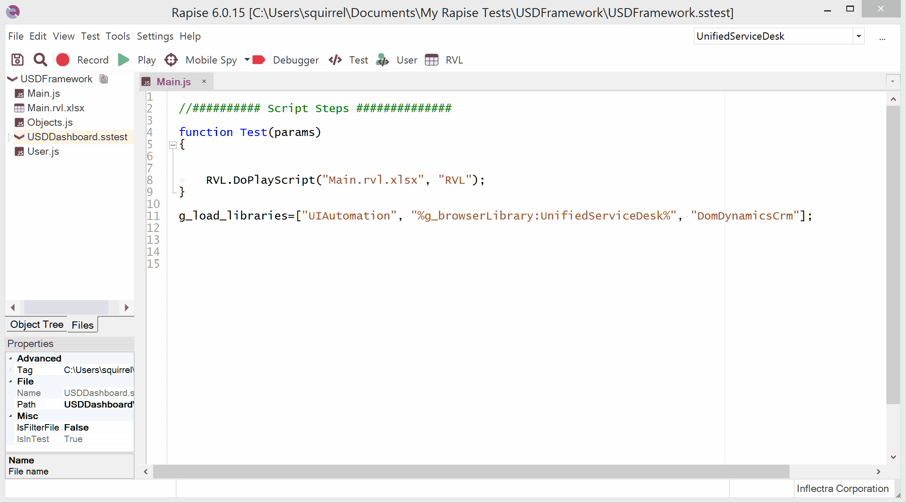

Also in `User.js` of USDDashboard insert a line:

```javascript
g_webPluginsAutoDetect = false;
```

We can now record web steps into USDDashboard.

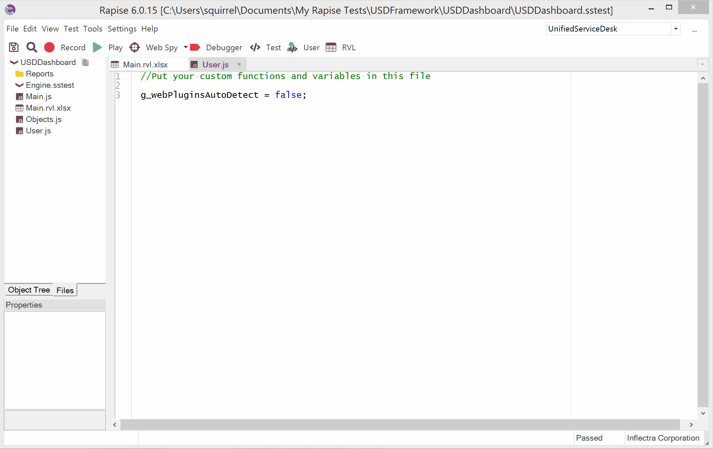

## Desktop Automation Sub-Test

For recording desktop content related actions create a sub-test inside USDFramework. Let's name it USDCallScript. Choose Desktop methodology along the way.

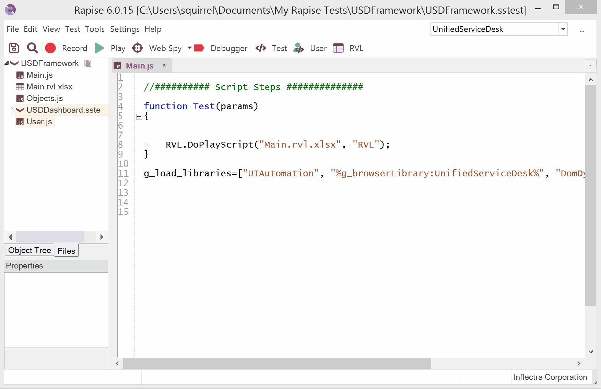

Double click USDCallScript test to open it in another instance of Rapise. Insert the following snippet into `Main.js`:

```javascript
function TestPrepare()
{
    if (g_recording)
    {
        g_UIAutomationWrapper.DeepPointTracking(true);
    }
}
```

`DeepPointTracking` flag fixes the bug in UI Automation tree of USD that prevents automation tools to track elements located under cursor.

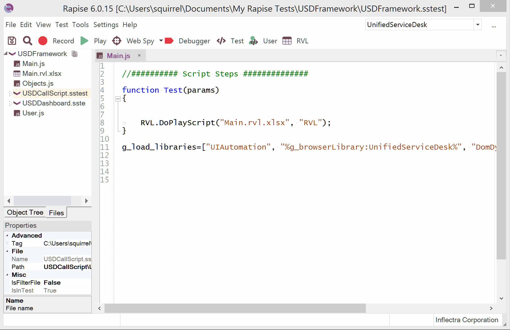

Let's record steps into USDCallScript. After pressing Record choose Unified Service desk in the list of applications.

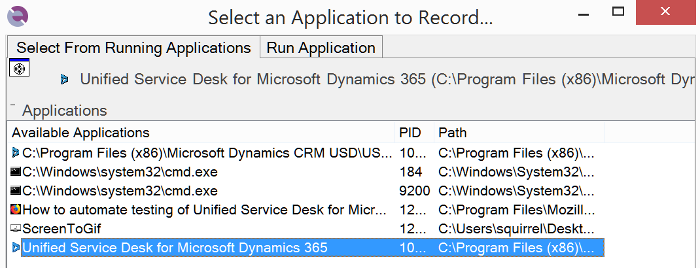

> **Note:** recording part is missing on the video above because screen capturing software interferes with Rapise doing desktop recording.

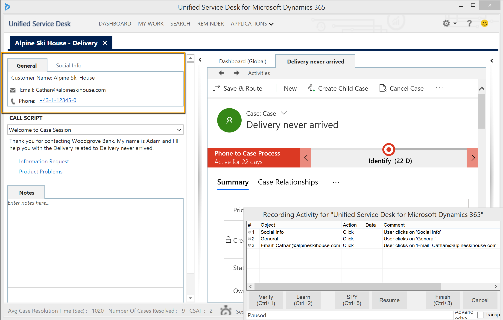

Here is the test playback.

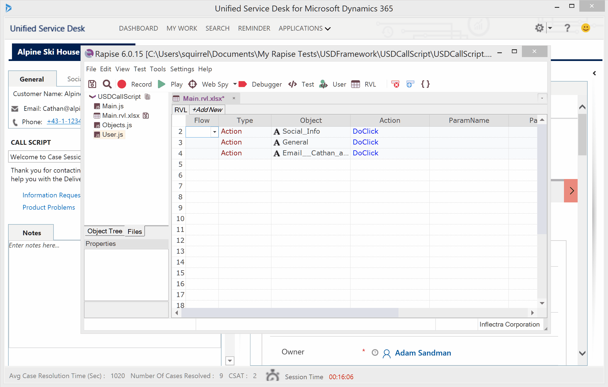

## Assembling Blocks

Now we can execute USDDashboard and USDCallScript from USDFramework. Open USDFramework test and drag-and-drop sub-tests to RVL sheet.


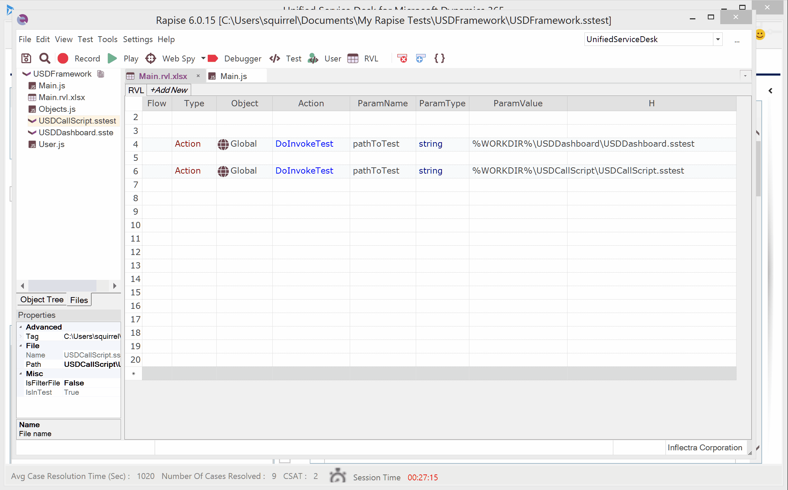

The test framework created in this session is [available on GitHub](https://github.com/Inflectra/rapise-framework-examples/tree/master/USDFramework).

## See Also

- [Microsoft Dynamics](microsoft_dynamics.md)
- [Get the framework for testing Unified Service Desk (github)](https://github.com/Inflectra/rapise-unified-service-desk)
- [Advanced example of testing USD on GitHub](https://github.com/Inflectra/rapise-dynamics365-samples/tree/master/UnifiedServiceDesk)
- [Testing Dynamics 365 for Sales](dynamics_crm.md)
