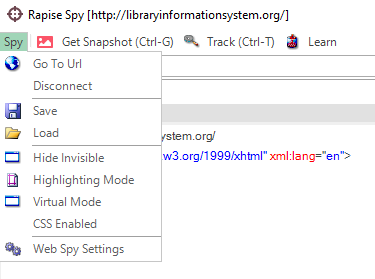
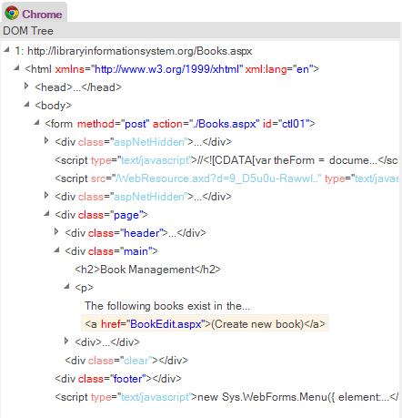
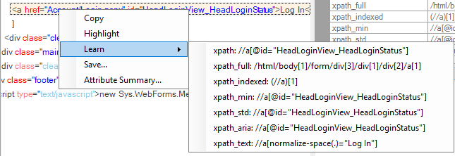
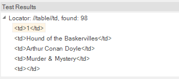
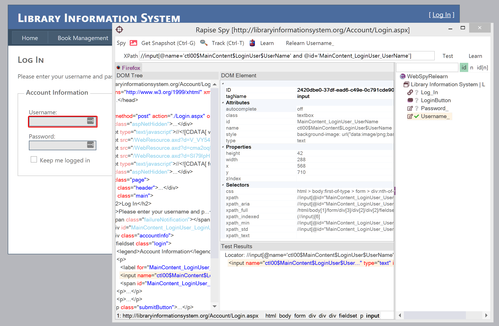

# Web Spy

## Purpose

The **Web Spy** is used to inspect web applications running on any of the supported web browsers (currently Internet Explorer, Firefox and Chrome). It allows you to view the hierarchy of elements in the web browser **Document Object Model (DOM)**. In addition it makes the testing of dynamic data-driven web applications easier because it lets you test out dynamic [XPath](xpath.md) or [CSS](css.md) queries against the web page and verify that the elements return match your expectations.

The **Web Spy** dialog shows a hierarchical representation of the HTML DOM elements that make up the web application being tested as well as the properties of the currently selected object. You can select the object by clicking on the object hierarchy displayed to the left. The properties displayed are categorized into different types that are described below.

The **Web Spy** also lets you visually highlight an item in the web browser from the object hierarchy and also the reverse - selecting an object in the hierarchy by clicking on its representation in the web browser.

## Spy Toolbar

The Web Spy toolbar provides the following tools:

- **Get Snapshot (Ctrl+G):** Clicking on this command will refresh the contents of the DOM Tree. This should be done whenever a change is made to the state of the web page in the web browser and you want to view how the DOM objects have been changed after the change.
- **Track (Ctrl+T):** This tool lets you select items in the web application as rendered by the web browser and have the corresponding object be selected in the DOM tree window. This is useful if you are not sure where an item is located in the DOM tree but you can see it in the browser.
- **Learn:** Clicking on this tool lets you take the currently selected object and add it to the [Object Tree](object_tree.md) for the current test. It can then be used as a scriptable object in the test script. When you click on the Learn button, you have the choice (in the dropdown list) of learning the object in terms of either its **XPath** or **CSS** properties.
- **XPath:** This field is described separately below in the **Test Results** section. These tool allow you to try out different XPATH queries to see which objects match. You can then Learn the results of these queries as new Rapise objects.

## Spy Menu

More tools available in the menu.

- **Go To Url:** Allows entering a URL and perform navigation in a remote browser. Handy when you connect to desktop browsers via Selenium or mobile browsers via Appium.
- **Disconnect:** Close connection to the browser and clear the DOM tree.
- **Save:** Use ot to save the DOM tree to an XML file.
- **Load:** Use it to load the DOM tree from an XML file.
- **Hide Invisible:** Selecting this item hides all elements with zero dimensions or `display: none` style from the DOM tree.
- **Highlighting Mode:** When this is selected, whenever you select an object in DOM Tree, it will highlight the item in the rendered web page with a red square. This allows you to visually see an item in the DOM tree and how it appears to the user.
- **Virtual Mode:** When virtual mode is **on** you can test XPath queries with the DOM tree loaded into Spy (browser is not used). You can load the tree from an XML file for example.
- **CSS Enabled:** Select to make CSS test field visible on the toolbar.
- **Web Spy Settings:** Clicking on this brings up the [Web Settings](web_settings.md) dialog box.

## Spy Shortcuts

- ++ctrl+g++ - reload the DOM tree from the active page in the browser.
- ++ctrl+t++ - start/stop tracking mode to locate the element in the DOM tree.
- ++ctrl+shift+t++ - save snapshot of the DOM tree. When the shortcut is pressed Rapise prompts for a name and saves the DOM tree in XML format and the screenshot of the browser window in PNG format.

## DOM Tree

The DOM tree lets you view all of the HTML elements (also known as DOM elements) that make up the web application / web page being tested. The elements are showing in a hierarchical tree representation that mirrors how they are nested on the page. Each element is displayed along with the various attributes (class, id, style, etc.) that are associated with the element:

The DOM elements are color coded.

- Tags and text are gray 

- Attribute names are red 

- Attribute values are blue 

- Elements that are not displayed on screen because of zero size or `display: none` style emphasized with lighter colors.

Sometimes you have more attributes displayed than can be easily red. To make viewing the DOM tree easier, you can use the [Web Settings](web_settings.md) dialog to set a list of attributes that should be excluded from the DOM tree pane.

When you right-click on an element it opens a popup menu with the following options:

- **Copy** - copies node text to clipboard (no attribute truncation).
- **Highlight** - highlights the element in the browser.
- **Learn** - expands the list of [various XPath locators](/Guide/web_settings/#different-types-of-xpath) generated for the element.  Click an item in this list and Rapise will learn the object with selected XPath.

Double clicking on an element copies it's [XPath](xpath.md) to the toolbar.

## DOM Element

When you click on an element in the DOM tree its properties are displayed in the **DOM Element** pane and it is highlighted in the web browser.

The properties that are displayed are grouped into the following categories:

- **Primary**
    - tagName - this contains the name of the HTML element
    - text - this contains a textual representation of all the HTML text nodes inside this element (if any)
- **Attributes** - all DOM attributes appear here. You see these attributes in red color in the DOM tree. Examples:
    - id - this contains the ID of the DOM element, if specified in the page
    - style - this contains the inline styles defined for the element
    - class - this contains the list of CSS classes applied to the element (separated by spaces if more than one)
- **Properties** - this contains the computed positional information about the element
    - height
    - width
    - x
    - y
    - zIndex
- **Selectors** - this section contains [XPath](xpath.md) and [CSS](css.md) selectors computed using different algorithms. If you will double click a name of the selector it will be copied to the edit field on the toolbar.

## Test Results

In addition to navigating the DOM tree and Learning specific elements, the other main capability of the DOM Spy is the ability to create queries using either [XPath](xpath.md) or [CSS](css.md) to see which objects match the query and then learn the specific result. For example we want to find all the table cells that have at least some style information specified.

### Using XPath

If you enter in the [XPath](xpath.md) query to locate the table cells in the **XPath** box at the top.

When you click **Test** it will display all of the DOM elements that match the query:

You can now refine the query to only find the items you want to test.

!!! note
    If you need to enter a non-breaking space in your search query (nbsp) you can do this by pressing ++shift+space++ key combination.

### Using CSS

If you enter in the [CSS](css.md) selector to locate the table cells in the **CSS** box at the top (if the box is not visible use menu `Spy > CSS Enabled`).

When you click **Test** it will display all of the DOM elements that match the query:

You can now refine the query to only find the items you want to test.

In either case, if you can adjust the query to only match a single element, you can then click the appropriate **Learn** button next to the **XPath** or **CSS** edit fields. That will learn the specified query as a new object that can be scripted against in Rapise. This is very useful if you want to dynamically select an object based on its content rather than a hard-coded ID or position. Also you can add an assertion to the test by clicking **Verify**. It will display [properties of the object](/Guide/verify_object_properties/). You may set checkboxes against properties you want to check during playback.

In addition, in the test results view, when you click on a result:

- The right-click popup menu is the same as for DOM Tree if type of the result is a DOM Element
- If the result is simple text then only Copy is available, which copies the text
- Clicking on a DOM element in the results list opens it in DOM Element pane and also selects it in the DOM Tree pane

## Maintenance Mode

Since Rapise **version 6.2** it is easier to check and update object locators. If you launch the spy from the toolbar (it will be launched in Maintenance Mode) it will show the object tree in the right side panel.

To check an object locator simply select the object in the object tree. The result of locator test is indicated by an icon.

If an object is found it will be highlighted in the browser and selected in the tree of application objects (left pane).

To fix a locator for object that is not found do the following:

1. Select the object in the object tree (right pane)
2. Select the element by
    - testing XPath locator from the toolbar
    - or directly in the DOM tree (left pane)
    - or by using object tracking.
3. Press relearn button on the toolbar.

## See Also

- [Object Spy](object_spy.md)
- [Save DOM tree to share with Rapise experts](https://www.inflectra.com/Support/KnowledgeBase/KB422.aspx)