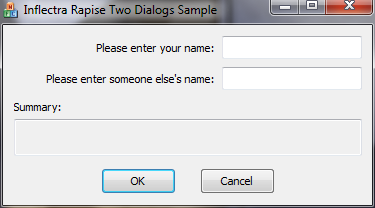
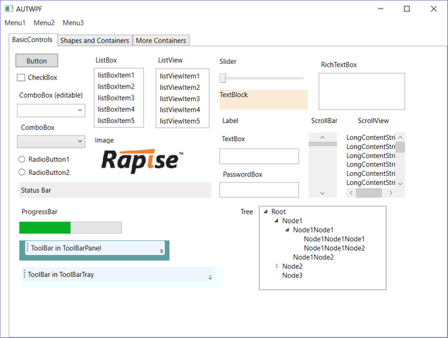

# Windows Applications

## Overview

Rapise provides comprehensive support for testing Microsoft Windows GUI applications, including applications written using **Win32, MFC, ATL**, Windows Forms, Visual Basic 6, Microsoft **.NET**, **ActiveX**, and Windows Presentation Framework (**WPF**).

Specifically, Rapise has support for the following technologies used tobuild Windows applications:

- **Win32 Applications**
    - Microsoft Foundation Classes (MFC)
    - ActiveX Template Library (ATL)
    - Visual Basic 6
    - ActiveX / COM
- **Microsoft .NET Applications**
    - WinForms
    - .NET 1.1,
    - .NET 2.0
    - .NET 4.x
- **Windows Presentation Framework (WPF)**
    - Silverlight
    - XAML
- **Modern / Metro Apps**
- **Third Party Component Libraries**
    - Infragistics WinForm Controls
    - Telerik RadControls
    - DevExpress Controls
    - ComponentOne ActiveX Controls
    - SyncFusion Windows Form Controls
    - FarPoint Spreadsheet Control

## Choosing the Right Windows Library

Since applications are often built using a mixture of different Windows technologies and component frameworks, we recommend that you use the following approach when testing Windows desktop applications with Rapise:

1. **First try recording using the "Auto" option**, this will let Rapise inspect the application and use the most appropriate libraries. Usually Rapise finds the correct libraries using its auto-detection, but sometimes an application is unusual and the auto-detection fails. If auto-detection is not reliable for your application, move on to step 2.
2. Select the "**UIAutomation Object"** Spy and try to inspect the application. If the Spy shows the real content of the application (i.e.
you see object names and IDs) then it is worth trying to record a test with the corresponding library called "**UIAutomation**" - [using the record application dialog box](select_an_application_to_record_dialog.md). This library is best for modern Windows applications.
3. If the recording is not picked up or does not play back correctly then the next step is to try recording with the "**Generic**" library. This is designed for older Windows Win32 applications. There is also a Spy tool for this library called the **"Accessible Object"** Spy.
4. If you have **third-party components** from Infragistics, Telerik, DevExpress, ComponentOne, SyncFusion or FarPoint, you may also need to select those libraries in addition to **Generic**.
5. If the recording is not sufficient then the last step is to try and record with the "**Advanced Accessibility**" library. This library
contains definitions of accessible controls at a very basic level. It is not very sophisticated, but it is often sufficient for many cases and works across a wide range of applications.
6. If neither of options below satisfy then it may be worth to try low level recording (<https://www.inflectra.com/Support/KnowledgeBase/KB114.aspx>).
  
## Sample Applications

In the [Samples index](sample_tests.md) of this manual we provide a full list of all the samples included with Rapise, however for Windows applications there are a couple of key ones that are worth exploring:

***a) Two Dialogs***

This is a simple Win32 MFC application that uses the **Generic** library and lets you try some basic testing scenarios.

***b) Sample ATM***

This is a more robust Win32 MFC application that is based on a banking ATM. You should use the **Generic** library with this application:

***c) WPF Sample Application***

This application is a good test of the **UIAutomation** library and is a simple test application with all of the different types of control available for testing:

