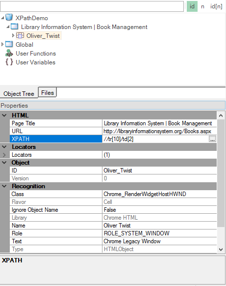
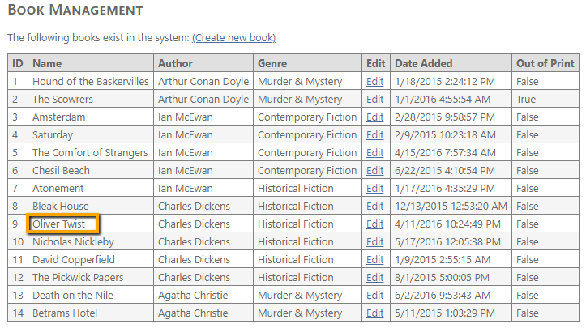

# Web Testing - Using XPath Queries

## Purpose

When testing web applications you will explicitly or implicitly use **XPath** expressions to query the browser **DOM** for elements based on the scenario under test. This section explains how XPath queries are used in Rapise and how to make your browser testing more flexible and adaptive to changes in the application you test.

## XPath Fundamentals

XPath uses path expressions to select nodes in an **XML** document such as **HTML**. The node is selected by following a path or steps.

Refer to [XPATH Tutorial](https://www.w3schools.com/xml/xpath_intro.asp) for more details.

## Rapise XPath Extensions

Web pages sometimes use **HTML** frames. The XPath works inside the frame contents. Rapise has a special syntax (that is not part of standard XPath) to combine multiple XPath statements into a single line:

```xpath
//frame[@name='main']@@@//a[3]
```

The special statement `@@@` is used as a separator for XPath statements pointing to constituent frames.

The top-level frame is found by name `main`

```xpath
//frame[@name='main']
```

Then the frame's contents are searched for the third `<a>` element (i.e. 3rd link on a page).

## Automatic XPath Generation on Record and Learn

When you do a [recording](recording.md) session, interact with web elements or [learn](object_learning.md) them - Rapise generates XPath [locators](https://www.inflectra.com/Support/KnowledgeBase/KB289.aspx) for the elements. You can view XPath of an object in the property grid:



## Using Web Spy

In some advanced cases you may need to construct XPath query manually. For this purpose we recommend using the [Web Spy](web_spy.md) tool:


If you enter in the XPath query at the top, when you click **Test** it will display all of the DOM elements that match the query:


You can now refine the query to only find the item you want to test.

### Learning Objects in Web Spy

When you have created the query in the Web Spy that returns the HTML element that you were expecting, you can click on the **Learn** button in the Web Spy toolbar to learn that element. What this will do is create a new Rapise object in the [Object Tree](object_tree.md) that maps to this specific XPath.

For example, if you want to find a specific book in a grid of books



you can search by its name using `text()` XPath function:

```xpath
//td[text()='Oliver Twist']
```

Then learn this object as **Oliver_Twist** so that you can access it in your code as `SeS("Oliver_Twist")`. Every time you call a function on **Oliver_Twist**, Rapise will use the learned XPath expression and use that to evaluate which HTML element in the web page to access.

## Dynamic Queries

In addition to learning objects based on specific XPath, there is [HTMLObject.DoDOMQueryXPath](/Libraries/HTMLObject/#DoDOMQueryXPath) action that can be used to query for elements in the web page:

```javascript
var res = SeS('MainContent_grdBooks').DoDOMQueryXPath('.//td[text()="Oliver Twist"]');
Tester.Message(res.length);
```

This will dynamically query for any HTML element that is a child of the learned **MainContent_grdBooks** object that matches the XPath. In this example it will look for any table cell that has the content of the book name.

You can also find an object dynamically without having any object in the object tree. To do this use [Navigator.Find](/Libraries/Navigator/#Find) action.

## See Also

- [KB282](https://www.inflectra.com/Support/KnowledgeBase/KB282.aspx) Elastic XPATH Expressions
- [KB363](https://www.inflectra.com/Support/KnowledgeBase/KB363.aspx) How to define a profile for Web Application in Rapise