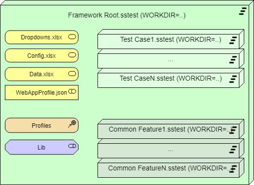
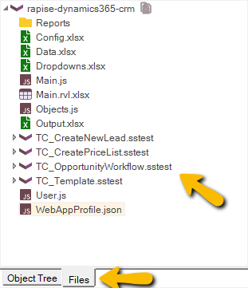
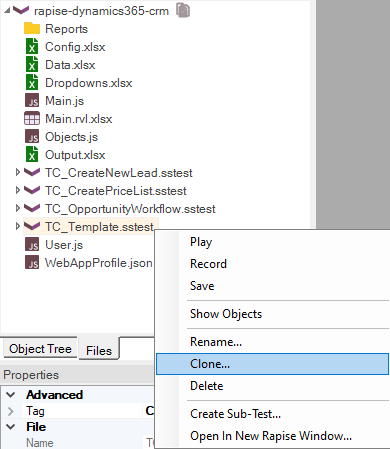

# How to Build a Test Framework with Rapise

Need to call one test from another? Need to run many tests? Have a test plan? It is time to build a testing framework. Learn how to do it with Rapise.

## How Framework Tests Are Structured

The Framework in Rapise is a regular test (**Framework Root**) containing a number of [Sub-Tests](../Guide/tests_and_sub_tests.md) (**Test Cases** and **Common Features**)



Where **Test Cases** are final test scenarios and **Common Features** are parts that are re-used and shared between the test cases.

When working with framework, the variable [%WORKDIR%](../Guide/tests_and_sub_tests.md#workdir-and-frameworks) always points to the root test case. This helps to find all common assets and files. For example, we always know that we may call `Common Feature1.sstest` using path `%WORKDIR%\Common Feature1\Common Feature1.sstest`. So we may call it from any other test case, from other common feature, from library and so on.

Also the same is true for accessing common [config](../Libraries/Global.md#SetConfigPath) and data files. I.e.

```javascript
Tester.SetConfigPath('%WORKDIR%\\Config.xlsx')
```

### Saving a Framework into Spira

The value of framework is in its consistency. There is one important rule that must be followed when saving framework to Spira:

> Framework root must be saved first. You need to save it at least once before saving any sub-tests. This will make sure that correct directory structure is defined in Spira.

Once you saved a root test to the Spira, all sub-tests always saved together with it, whenever you do it form the root or from any of sub-tests. Right after saving a root test case you have a framework and may start expanding it.

### Saving a Framework into Git

If you plan to maintain your framework using **Git** for [source control](../Guide/git_integration.md), please make sure to init git repository at framework root level or higher. Thus Rapise will be able to detect it.

### Framework Navigation: Root Test, Parent Test, Sub-Tests

There is a number of features intended to help one switching between test and sub-tests.

The `Files` [view](../Guide/test_files_dialog.md) shows all nested sub-tests. You may open any of them by double-clicking on the `.sstest` node:



The test opens in the current Rapise instance. You may also open it in a new window using the **Open in New Rapise Window...** command from the  [Context Menu](../Guide/tests_and_sub_tests.md#sub-test-context-menu).

You may then switch back to parent test or framework root by using **Test/Open Root ......** and **Test/Open Parent .....** [menu items](../Guide/menu_and_toolbars.md#test).

### Template Test Case and Clone

Usual practice in Framework is to use the [Clone](../Guide/tests_and_sub_tests.md#sub-test-context-menu) feature to produce new sub-tests. So the template test is created and pre-configured (to contain right lib, functions and file references) and then replicated for each next cloned test case.



### Calling Other Tests

There is a number of ways to call one sub test from another. Usually the test representing a scenario calls another test representing common routine or shared step. It is possible to pass some parameters to the called sub-test.

> In most cases you may use Drag&Drop from the [Files](../Guide/test_files_dialog.md) view into text or RVL editor to generate a call statement.

#### Executing Full Test

From RVL:
[RVL.DoPlayTest](../Libraries/RVL.md#doplaytest)

From JS:
[Global.DoInvokeTest](../Libraries/Global.md#DoInvokeTest)

#### Execute One RVL Sheet from Current or Another Test in the Framework

From either RVL or JS:

[RVL.DoPlayScript](../Libraries/RVL.md#doplayscript)

[RVL.DoPlaySheet](../Libraries/RVL.md#doplaysheet)

#### Parallel Test Execution

From RVL:
[RVL.DoPlayTestParallel](../Libraries/RVL.md#doplaytestparallel)

From JS:
[Global.DoInvokeTestParallel](../Libraries/Global.md#doinvoketestparallel)

### Dropdowns.xlsx

Shared Libraries and Shared Functions more powerful with pre-defined [dropdowns](../Guide/rvl_editor.md#param-dropdowns). For example, you may have a function `NavigateToModule` used across your framework and switching to an application module. Since we have fixed number of modules in the app (it may be a big number, but still fixed) we may define a dropdown list to make it easier for test creator to navigate without risk of doing a typo and without loss of time to find correct naming.


### Config.xlsx

There is a [Config](../Libraries/Global.md#SetConfigPath) file, that may be used for further [Global.GetProperty](../Libraries/Global.md#getproperty) and [Global.SetProperty](/Libraries/Global/#setproperty). This is an easy way to read and store various input configuration data: logins, URLs as well as output data (i.e. Internal Invoice ID used in the subsequent test cases).

It is also explained in [this](https://youtu.be/GDbRA2WyQfQ?list=PL1GncVUgF5nsawBrTNYbBY-eUnccO5YZj&t=534) video.

### Data.xlsx

It is typical implement some test cases as [data driven](../Intro/ddt.md). And framework is a great place for storing the shared data files - usually `.xlsx` spreadsheets. Rapise has built in capabilities for [creating](../Guide/test_files_dialog.md#context-menu-folder) and [editing](../Guide/spreadsheet_editor.md) such spreadsheets.

### Global Objects

It is useful to have one or more application specific [global objects](../Guide/global_objects.md), sharing functionality needed by majority of test cases in your framework. It may do anything, starting from login and navigation and up to string formatting or text validation.


### Libraries

One may define a [custom library](../Guide/custom_libraries.md) containing common functions, global objects or even rules for [test playback](../Guide/playback.md), [object learning](../Guide/object_learning.md) and [test recording](../Guide/recording.md).

### Sharing JS Files

Simple way to have common shared logic is to have a common `User.js` [file](../Guide/defining_functions.md#in-userjs) defining some functions.

For more complex cases, you may have additional `.js` files and [include](https://www.inflectra.com/Support/KnowledgeBase/KB308.aspx) them in tests.

### Profiles

Local [Web](../Guide/browser_settings/#local-browser-profiles) or [Mobile](../Guide/mobile_settings_dialog/#local-mobile-profiles) Profiles makes it easier to configure the browsers for the whole framework.

### WebAppProfile.json

For web tests the [WebAppProfile](../Guide/web_app_profile.md) may greatly improve the speed and quality of recording. The profile may be defined on the framework root and thus be effective when working on all the contained sub-tests.

## See Also

- [Framework for Testing Web Applications with Rapise (video)](https://youtu.be/zROIrQs8tP0)
- [Tests and Sub-Tests](../Guide/tests_and_sub_tests.md)
- [Passing Sub-Test Parameters (KB)](https://www.inflectra.com/Support/KnowledgeBase/KB501.aspx)
- [Framework Example (GitHub)](https://github.com/Inflectra/rapise-framework-examples/tree/master/SpiraFriendlyWithRvlAndUserLib)
- [More Framework Examples (GitHub)](https://github.com/Inflectra/rapise-framework-examples)
- [Defining Global Objects](../Guide/global_objects.md)
- [RVL Parameter Dropdowns](../Guide/rvl_editor.md#param-dropdowns)