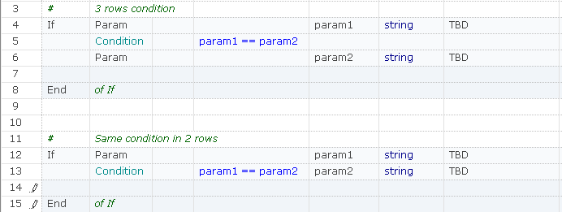
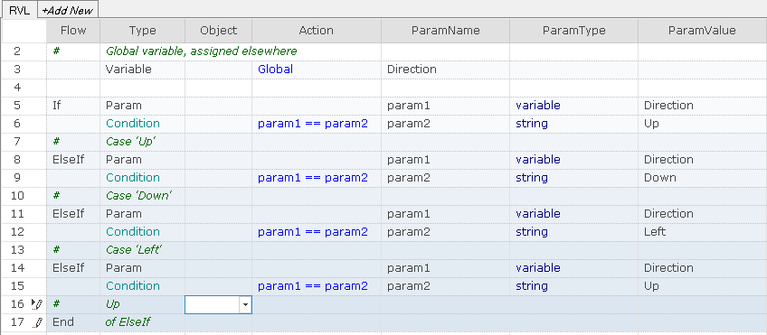

# Conditions

Conditions used in `If` and `Assert` statements. 

## Types of Conditions

Condition accepts one or two [Params](Params.md). 

1. There might be just one *Param*. Such condition is called *unary*, for example `param1 is true` or `output1 is true`.
2. There might be second *Param*. Such condition is called *binary*, for example `param1 == param2`. 
3. Condition parameter may be either *Param* or *Action* output.
4. *Param* is some fixed *value*, *variable* or *expression*.

Binary condition with two *Param*s named `param1` and `param2`:

| ... | *Type*    | ... | *Action*           | *ParamName* | ... |
| --- | --------- | --- | ------------------ | ----------- | --- |
| --  | Param     |     |                    | param1      |
| --  | Condition |     | *param1 == param2* |             |
| --  | Param     |     |                    | param2      |

Binary condition with *Action* and *Param* named `output1` and `param2`:

| ... | *Type*    | *Object* | *Action*           | *ParamName* | ... |
| --- | --------- | -------- | ------------------ | ----------- | --- |
| --  | Action    | MyButton | GetText            |             |
| --  | Condition |          | *outpu1 == param2* |             |
| --  | Param     |          |                    | param2      |

Binary condition with two *Action*s named `output1` and `output2`:

| ... | *Type*    | *Object*  | *Action*            | *ParamName* | ... |
| --- | --------- | --------- | ------------------- | ----------- | --- |
| --  | Action    | MyButton1 | GetText             |             |
| --  | Condition |           | *outpu1 != output2* |             |
| --  | Action    | MyButton2 | GetText             |             |

Unary condition with *Param* `param1`:

| ... | *Type*    | ... | *Action*         | *ParamName* | ... |
| --- | --------- | --- | ---------------- | ----------- | --- |
| --  | Param     |     |                  | param1      |
| --  | Condition |     | *param1 IsFalse* |             |

Unary condition with *Action* `output1`:

| ...       | *Type*   | *Object*        | *Action* | *ParamName* | ... |
| --------- | -------- | --------------- | -------- | ----------- | --- |
| Action    | MyButton | GetEnabled      |          |
| Condition |          | *outpu1 IsTrue* |          |

## All Conditions
### Unary conditions with *Param*

| *Caption*          | *Description*                                                      |
| ------------------ | ------------------------------------------------------------------ |
| `param1` IsTrue    | Check if `param1` is true                                          |
| `param1` IsFalse   | Check if `param1` is false                                         |
| `param1` IsNull    | Check if `param1` is null                                          |
| `param1` IsNotNull | Check if `param1` is NOT null                                      |
| `param1` IsSet     | Check if `param1` is NOT null, false, 0, empty string or undefined |
| `param1` IsNotSet  | Check if `param1` is null, 0, false, empty string or undefined     |

### Unary conditions with *Action*

| *Caption*           | *Description*                                                       |
| ------------------- | ------------------------------------------------------------------- |
| `output1` IsTrue    | Check if `output1` is true                                          |
| `output1` IsFalse   | Check if `output1` is false                                         |
| `output1` IsNull    | Check if `output1` is null                                          |
| `output1` IsNotNull | Check if `output1` is NOT null                                      |
| `output1` IsSet     | Check if `output1` is NOT null, false, 0, empty string or undefined |
| `output1` IsNotSet  | Check if `output1` is null, 0, false, empty string or undefined     |

### Binary conditions with *Param*s

| *Caption*                   | *Description*                                       |
| --------------------------- | --------------------------------------------------- |
| `param1` == `param2`        | Check if `param1` equals to `param2`                |
| `param1` != `param2`        | Check if `param1` NOT equal to `param2`             |
| `param1` > `param2`         | Check if `param1` is more than `param2`             |
| `param1` >= `param2`        | Check if `param1` is more or equal to `param2`      |
| `param1` <= `param2`        | Check if `param1` is less or equal to `param2`      |
| `param1` < `param2`         | Check if `param1` is less than `param2`             |
| `param1` contains `param2`  | Check if `param1` contains `param2` as substring    |
| CmpImage `param1`, `param2` | Compare 1st image and image represented by `param2` |

### Binary conditions with *Action* and *Param*

| *Caption*                    | *Description*                                       |
| ---------------------------- | --------------------------------------------------- |
| `output1` == `param2`        | Check if `output1` equals to `param2`               |
| `output1` != `param2`        | Check if `output1` NOT equal to `param2`            |
| `output1` > `param2`         | Check if `output1` is more than `param2`            |
| `output1` >= `param2`        | Check if `output1` is more or equal to `param2`     |
| `output1` <= `param2`        | Check if `output1` is less or equal to `param2`     |
| `output1` < `param2`         | Check if `output1` is less than `param2`            |
| `output1` contains `param2`  | Check if `output1` contains `param2` as substring   |
| CmpImage `output1`, `param2` | Compare 1st image and image represented by `param2` |

### Binary conditions with *Action*s

| *Caption*                     | *Description*                                        |
| ----------------------------- | ---------------------------------------------------- |
| `output1` == `output2`        | Check if `output1` equals to `output2`               |
| `output1` != `output2`        | Check if `output1` NOT equal to `output2`            |
| `output1` > `output2`         | Check if `output1` is more than `output2`            |
| `output1` >= `output2`        | Check if `output1` is more or equal to `output2`     |
| `output1` <= `output2`        | Check if `output1` is less or equal to `output2`     |
| `output1` < `output2`         | Check if `output1` is less than `output2`            |
| `output1` contains `output2`  | Check if `output1` contains `output2` as substring   |
| CmpImage `output1`, `output2` | Compare 1st image and image represented by `output2` |

## *And*, *Or* Conditions
It is possible to make more complex conditions by using *And* and *Or* keyword in the *Flow* column.

| *Flow*    | *Type* | ...              | *Action* | *ParamName* | *ParamType* | *ParamValue* |
| --------- | ------ | ---------------- | -------- | ----------- | ----------- | ------------ |
| If        | Param  |                  |          | param1      | *variable*  | `Result1`    |
| Condition |        | *param1 IsFalse* |          |
| **And**   | Param  |                  |          | param1      | *variable*  | `Result2`    |
| Condition |        | *param1 IsTrue*  |          |
| ...       | ...    |                  | ...      | ...         | ...         | ...          |

This pice forms a condition checking that `Result1` is false AND `Result2` is true at the same time.

| *Flow*    | *Type* | *Object*          | *Action*   | *ParamName* | *ParamType* | *ParamValue* |
| --------- | ------ | ----------------- | ---------- | ----------- | ----------- | ------------ |
| If        | Action | MyButton          | GetEnabled |             |             |              |
| Condition |        | *output1 IsFalse* |            |
| **Or**    | Param  |                   |            | param1      | *variable*  | `Result1`    |
| Condition |        | *param1 IsTrue*   |            |
| ...       | ...    |                   | ...        | ...         | ...         | ...          |

This pice forms a condition checking that *MyButton* is Enabled OR `Result2` is true at the same time.

## Examples

Condition is never used alone. You may find examples of conditions in chapters devoted to [Assertions](Assertions.md) and [If-Then-Else](IfElse.md).

## Short Condition Syntax

All binary conditions with `param2` take 3 rows. Sometimes it is more convenient to use shorter 2 row syntax where `param2` value is specified on the same row as the condition itself:

| ... | *Type*    | ... | *Action*           | *ParamName* | ... |
| --- | --------- | --- | ------------------ | ----------- | --- |
| --  | Param     |     |                    | param1      |
| --  | Condition |     | *param1 == param2* | **param2**      |

Here is the same condition presented in 3 rows (default) and 2 rows (short) form:

2 rows condition syntax together with [If-Else](IfElse.md) may be used to mimic a `switch` statement:

If there is an `Action` result used insted of `param` then it is recommended to first save it to the [Variable](Variables.md).