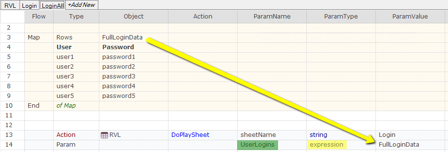
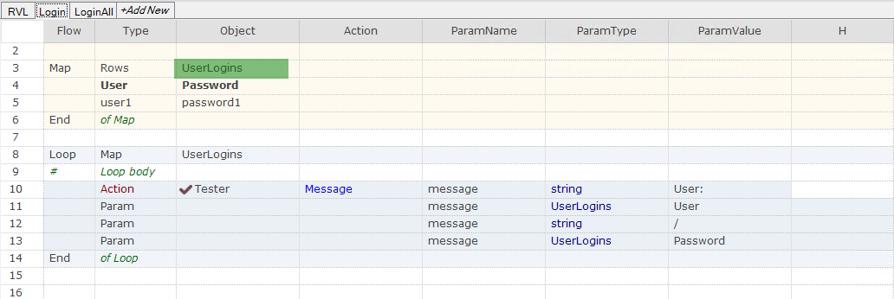

# RVL Sheets

RVL script may contain one or more sheets distributed over one or more workbooks.

Sheet is an atomic building block for implementing test frameworks and sharing logic.

For example, there may be a Sheet called `Login` and it may be re-used by **CreateNewBook**, **CreateExistingBook**  and other test scenarios that require **Login** logic.

Default sheet name is `RVL`. You may rename it. You may add more sheets.

RVL sheet is executable when it have 7 pre-defined [Columns](Columns.md). The workbook may contain both executable and data sheets.

## Calling Sheets

It is possible to do calls between scripts using [RVL.DoPlayScript](../Libraries/RVL.md#doplayscript) and [RVL.DoPlaySheet](../Libraries/RVL.md#doplaysheet).

## Passing Parameters

It is possible to pass parameters between sheets. See [Passing Input Parameters](RVL_DoPlay.md#passing-input-parameters)

## Passing Maps

You may pass a [Map](Maps.md) between sheets as  [input parameters](RVL_DoPlay.md#passing-input-parameters).

For example, here we pass a map `FullLoginData`:

as a value to override the map `UserLogins` on the `Login` sheet:

## RVL File

Default file format for RVL scripts is an Excel workbook. It makes it easier to combine data with script logic. Any RVL file has extension `.rvl.xlsx` and may be open in **MS Excel** directly.
